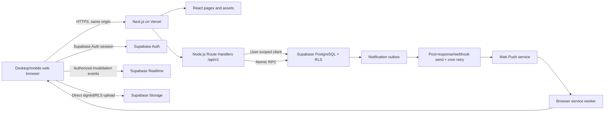
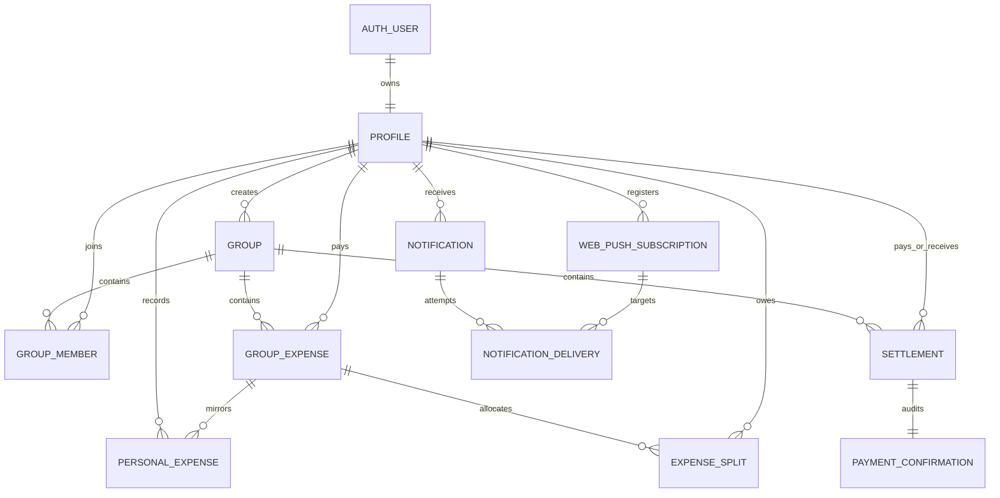

# Expenso Web Application Rebuild — Master Product, UX, API, and Backend Blueprint

**Document status:** Implementation contract

**Version:** 2.0 — web architecture revision

**Prepared:** 2026-08-13

**Audience:** Frontend owner, backend owner, coding agents, reviewers, testers
**Source audited:** Existing Kotlin/Jetpack Compose application, active Supabase migrations, notification function, tests, and project documentation in this repository

---

## 0. How to use this document

This file is the shared source of truth for rebuilding Expenso as a responsive web application while retaining the existing product's behavior.

The product, workflows, rules, visual language, and feature set remain Expenso. The implementation changes from Kotlin/Jetpack Compose to a full-stack React/Node.js website built with Next.js and hosted as one Vercel project under one public domain.

“Bursell” in the project discussion is interpreted as **Vercel**. If a different hosting provider was intended, deployment-specific sections must be reviewed before implementation.

Both owners and every coding agent must read these parts before implementation:

1. Product scope and invariants
2. Screen specifications
3. Shared domain types
4. API contract
5. Database transaction rules
6. Authentication, authorization, notifications, and UPI rules
7. Acceptance criteria

When this blueprint conflicts with an old markdown file, prefer this blueprint. When it conflicts with an applied database migration, inspect the migration and update this blueprint through a reviewed change. Do not silently invent behavior.

### Ownership

- **Frontend owner:** `apps/web/src/app` page/layout code outside `api`, `apps/web/src/components`, browser tests, responsive visual parity, client state, and typed API consumption.
- **Backend owner:** `apps/web/src/app/api`, `apps/web/src/server`, Supabase migrations, authorization, transactions, notification delivery, API tests, and Vercel deployment.
- **Shared ownership:** `packages/contracts`, `packages/domain`, OpenAPI document, fixtures, end-to-end acceptance tests.
- Neither owner may change a shared request, response, enum, money rule, route, or error code without updating shared contracts and notifying the other owner.

---

## 1. Product definition

### 1.1 Product statement

Expenso is a responsive personal and shared expense web application. Users record personal income and spending, create groups, split shared expenses, see pairwise debts, initiate UPI payments from supported devices or QR codes, and settle balances through two-party confirmation.

### 1.2 Product promise

> Track. Split. Settle. — Beautifully.

### 1.3 Primary users

- An individual tracking personal income and expenses.
- A group member recording and splitting trip, household, event, or meal expenses.
- A group administrator managing group identity and membership.
- A payer settling an amount through UPI.
- A receiver confirming or rejecting a claimed payment.

### 1.4 V1 goals

- Responsive website for mobile, tablet, laptop, and desktop browsers.
- One Next.js/Vercel application: frontend pages and Node.js API served from the same domain.
- Email/password authentication.
- Personal transaction CRUD and analytics.
- Group creation, membership, shared expenses, and balances.
- Equal, exact, and percentage splits.
- UPI launch plus two-party settlement confirmation.
- Persistent notification inbox plus optional standards-based browser Web Push.
- Profile and UPI ID management.
- Secure multi-user data isolation.
- Clear API boundary so frontend and backend can be developed independently.

### 1.5 Non-goals for parity release

- Native Android or iOS application.
- APK/AAB packaging or app-store distribution.
- Bank account sync, card sync, or UPI transaction verification.
- Automatic payment confirmation.
- Currency conversion or mixed currencies inside one group.
- Receipt OCR.
- Recurring transactions.
- Budgets.
- Export/import.
- Charts beyond existing category summaries.
- Contacts-based invites or invites to users who have not registered.
- Offline financial writes.
- Admin role transfer. This remains blocked until an atomic server operation exists.

---

## 2. Non-negotiable product invariants

These rules are more important than any individual screen design.

1. All money is stored and transmitted as decimal values with exactly two fractional digits. Never use JavaScript floating-point arithmetic for authoritative money calculations.
2. Group-expense creation, split creation, linked personal transactions, and affected balance recalculation are one atomic database operation.
3. Split amounts must add exactly to the group-expense total after cent allocation.
4. Every payer and split participant must still belong to the group at commit time.
5. Group-created personal transactions are read-only from the personal ledger. They can only change by changing or deleting the source group expense.
6. Only a group-expense payer or group admin may delete that expense.
7. A member with unresolved debt or a pending settlement cannot be removed.
8. A group with financial history is retained for audit and cannot be deleted. An empty group with no pending settlements may be deleted by an admin.
9. A payer cannot propose more than the current outstanding amount.
10. At most one pending settlement may exist for the same group, payer, and receiver.
11. Only the receiver may confirm or reject a pending settlement.
12. Settlement confirmation is serialized, idempotent, and allocated oldest-first to outstanding splits.
13. A UPI URI launch, browser return, or QR scan never proves payment. Receiver confirmation remains required.
14. Personal spending analytics count expense shares, not reimbursements. Settlements reduce group debt; they do not erase historical spending.
15. User identity comes from the verified server-side Supabase session. Client-supplied user IDs never authorize an operation.
16. Browser push delivery is secondary. Every notification must exist in the persistent inbox even when push is unsupported, denied, or fails.
17. Notification and write retries must be idempotent.
18. Server responses and logs must never expose service-role keys, VAPID private keys, password values, access tokens, refresh tokens, session cookies, or settlement confirmation secrets.

---

## 3. Final technology stack

### 3.1 Frontend and web framework

| Concern | Choice |
|---|---|
| Framework | Current stable Next.js App Router + React, TypeScript strict mode |
| Rendering | Server Components for shells/read-only initial render; Client Components only where interaction requires them |
| Routing | Next.js App Router |
| Styling | Tailwind CSS + CSS variables; Radix UI primitives where accessible behavior is complex |
| Server state | TanStack Query |
| Local UI/session state | Zustand only where context or component state is insufficient |
| Forms | React Hook Form |
| Validation | Zod schemas imported from `packages/contracts` |
| Precise money preview | `decimal.js` or `big.js`, wrapped by `packages/domain` |
| Authentication | `@supabase/ssr` + `@supabase/supabase-js`, cookie-based SSR session |
| Browser persistence | Cookies for auth; local/session storage only for non-sensitive preferences |
| Notifications | Persistent inbox; Web Push API + service worker + VAPID where supported |
| Images | Next.js Image for display; browser File API for selection; client compression before direct Storage upload |
| Navigation links | Normal HTTPS URLs through Next.js `Link`/router |
| UPI | User-gesture `upi://pay` launch on supported mobile browsers; QR/copy fallback on desktop |
| Animation | CSS transitions; Motion only for interactions needing orchestration |
| Blur/glass | CSS `backdrop-filter` with solid fallback |
| Icons | Lucide React |
| Unit/component tests | Vitest + React Testing Library |
| End-to-end tests | Playwright |
| Quality | ESLint, Prettier, TypeScript, axe accessibility checks, Lighthouse budgets |

Frontend source uses the Node.js ecosystem for installation, builds, server rendering, and tooling. Interactive React components execute in the browser; they do not literally run inside Node.js. This distinction must remain clear when assigning frontend and backend work.

### 3.2 Backend

| Concern | Choice |
|---|---|
| Runtime | Current Node.js LTS |
| Language | TypeScript, strict mode |
| HTTP layer | Next.js Route Handlers under `/api/v1/*`, explicitly using Node.js runtime |
| Request/response validation | Zod from `packages/contracts` |
| API description | OpenAPI generated from route schemas |
| Database/Auth/Storage/Realtime | Supabase |
| Database | PostgreSQL managed by Supabase |
| Financial transactions | PostgreSQL functions/RPCs |
| Normal CRUD | User-scoped Supabase client, backed by RLS |
| Admin-only jobs | Separate service-role Supabase client |
| Push delivery | Standards-based Web Push using VAPID; persistent inbox remains canonical |
| Structured logs | Pino with redaction |
| Tests | Vitest, Route Handler/service tests, SQL contract/integration tests |

Follow the supported [Supabase Next.js server-side authentication pattern](https://supabase.com/docs/guides/auth/server-side/nextjs) and [SSR security/caching guidance](https://supabase.com/docs/guides/auth/server-side/advanced-guide) for browser/server clients, cookie refresh, identity verification, and protected server rendering.

### 3.3 Why keep Supabase

The existing product already relies on PostgreSQL constraints, RLS, Auth, Storage, Realtime, transactional functions, and notification outbox tables. Replacing all of that with Vercel-hosted custom persistence would increase risk and duplicate working infrastructure. Next.js Route Handlers provide the Node.js backend-for-frontend and business API; Supabase remains managed persistence and authentication infrastructure.

### 3.4 Deployment recommendation

- **Frontend + Node.js backend:** one Next.js project deployed to Vercel.
- **Public origin:** one canonical custom domain, for example `https://expenso.example`; pages use `/...`, API uses `/api/v1/...`, auth callback uses `/auth/callback`.
- **Database/Auth/Storage/Realtime:** Supabase. These are managed dependencies, not separate public application domains.
- **Push worker:** first delivery attempt through a post-response Node task or secured database webhook; retry drain through a secured Vercel Cron route.
- **Preview:** every pull request receives one Vercel preview deployment containing matching frontend and backend code.

Next.js Route Handlers support public backend-for-frontend endpoints and use the Node.js runtime by default. Vercel deploys them as stateless functions: they cannot share in-memory state between requests, should not write persistent files, and cannot host a WebSocket server. Supabase Realtime therefore connects directly from authorized browser clients. See [Next.js backend-for-frontend guidance](https://nextjs.org/docs/app/guides/backend-for-frontend), [Vercel Function limits](https://vercel.com/docs/functions/limitations), and [Vercel platform limits](https://vercel.com/docs/limits).

Vercel Hobby currently permits only once-daily cron execution with imprecise timing. Prompt notification delivery must not depend on Hobby cron; use transaction-adjacent delivery/database webhook for the first attempt. Reliable frequent retries require Vercel Pro or another reviewed queue/worker. See [Vercel Cron limits](https://vercel.com/docs/cron-jobs/usage-and-pricing). Vercel custom domains and TLS attach to the same project. See [Vercel custom domains](https://vercel.com/docs/domains/set-up-custom-domain).

**Launch rule:** Vercel and Supabase free tiers are acceptable for development and a private MVP. A public production launch needs paid capacity where necessary, backups, monitoring, usage alerts, and an explicit monthly budget.

---

## 4. Repository and team structure

Use one monorepo and one deployable Next.js application so contracts cannot drift and frontend/backend always deploy together.

```text
expenso-next/
├── apps/
│   └── web/
│       ├── src/
│       │   ├── app/
│       │   │   ├── (auth)/              # Login, signup, callback
│       │   │   ├── (dashboard)/         # Authenticated pages/layouts
│       │   │   ├── api/v1/              # Public same-origin Node Route Handlers
│       │   │   ├── api/internal/        # Cron/webhook routes with separate auth
│       │   │   ├── error.tsx
│       │   │   ├── layout.tsx
│       │   │   └── not-found.tsx
│       │   ├── components/               # Frontend-owned UI primitives/features
│       │   ├── features/                 # Client hooks, forms, view adapters
│       │   ├── lib/                      # Browser-safe helpers and API client
│       │   ├── server/                   # Backend-owned services/repositories/auth
│       │   │   ├── auth/
│       │   │   ├── config/
│       │   │   ├── modules/
│       │   │   ├── notifications/
│       │   │   ├── repositories/
│       │   │   └── supabase/
│       │   ├── styles/
│       │   └── proxy.ts                  # Session refresh and route protection only
│       ├── public/
│       │   ├── icons/
│       │   ├── manifest.webmanifest
│       │   └── sw.js                     # Web Push/service-worker behavior
│       ├── next.config.ts
│       ├── vercel.json
│       └── package.json
├── packages/
│   ├── contracts/                       # Zod schemas, DTOs, enums, OpenAPI
│   ├── domain/                          # Pure money/split/date logic
│   ├── api-client/                      # Generated same-origin typed API client
│   ├── fixtures/                        # Shared deterministic mock data
│   ├── eslint-config/
│   └── typescript-config/
├── supabase/
│   ├── migrations/
│   ├── seed.sql
│   └── tests/
├── docs/
│   ├── EXPENSO_WEB_APP_MASTER_BLUEPRINT.md       # This file
│   ├── openapi.json
│   ├── decisions/
│   └── runbooks/
├── pnpm-workspace.yaml
├── package.json
└── README.md
```

### 4.1 Branch and change discipline

- Branches: `feat/frontend-*`, `feat/backend-*`, `fix/*`, or team convention.
- Shared contract change first: schema, example, tests, OpenAPI, generated client.
- Frontend must never handwrite a second incompatible DTO type.
- Backend must never return undocumented fields that frontend depends on.
- Every pull request states whether API contract changed.
- Contract-breaking changes require a version bump or coordinated same-release deployment.

### 4.2 Independent development workflow

1. Backend defines/updates Zod request and response schema.
2. OpenAPI and typed client regenerate.
3. Fixture and Mock Service Worker handler update.
4. Frontend builds against mock API immediately.
5. Backend implements route to pass same contract tests.
6. Integration environment replaces the mock handler with same-origin `/api/v1` without component changes.

---

## 5. Information architecture and navigation

### 5.1 Root routing

```text
Initial request
├── no valid session → Login or Sign up
├── valid session + incomplete profile → Onboarding
└── valid session + complete profile → Dashboard
```

The protected dashboard layout performs the authoritative server-side session and onboarding check. Client-side guards improve transitions but are not a security boundary. While the browser hydrates or renews an existing session, show a branded loading shell rather than flashing protected or login content.

### 5.2 Primary navigation

1. Home
2. Expenses
3. Groups
4. Profile

Use one responsive navigation component with the same destinations and active-state semantics:

- Desktop (1024 px and wider): persistent left sidebar, content header, and notification control.
- Tablet: compact sidebar or top navigation according to available width.
- Mobile browser: fixed bottom navigation for the four root destinations, with safe-area padding.

Hide the mobile bottom navigation on focused forms and confirmation flows when it would compete with the primary action. The desktop shell may retain its sidebar on detail pages if space permits. Every destination must remain reachable by a normal URL, keyboard navigation, and browser history.

### 5.3 Route map

```text
/login
/signup
/auth/callback
/onboarding
/dashboard
/expenses
/groups
/profile
/expenses/new?type=expense|income
/expenses/[expenseId]/edit
/groups/new
/groups/[groupId]
/groups/[groupId]/settings
/groups/[groupId]/expenses/new
/groups/[groupId]/settle/[receiverId]
/groups/[groupId]/settlements/[settlementId]
/profile/edit
/notifications
```

Next.js route groups such as `(auth)` and `(dashboard)` may organize source files but must not appear in public URLs.

### 5.4 Shareable and notification URLs

| Link | Destination |
|---|---|
| `/groups/{groupId}` | Group detail |
| `/groups/{groupId}/settlements/{settlementId}` | Settlement confirmation |
| `/notifications` | Notification inbox |

Store relative paths in notification records and resolve them against `NEXT_PUBLIC_SITE_URL` only at the delivery boundary. Every ID segment must parse as UUID. Invalid or unauthorized URLs render a safe “Link unavailable” state; never interpolate unchecked paths. When authentication is required, redirect through `/login?next=<encoded-relative-path>` and accept only allowlisted same-origin paths to prevent open redirects.

---

## 6. Complete feature inventory

### 6.1 Authentication and onboarding

- Branded loading shell and server-verified session restore.
- Email/password sign-in.
- Email/password sign-up with full name.
- Email-confirmation-required state when configured by Supabase.
- Profile auto-creation from auth metadata.
- First-use onboarding with display name and optional UPI ID.
- Secure cookie-based session persistence and refresh.
- Secure sign-out, including removal of the current browser's Web Push subscription when possible.

### 6.2 Personal finance

- Add income.
- Add personal expense.
- Edit personal transaction.
- Delete personal transaction after confirmation.
- Monthly browsing.
- All/income/expense filters.
- Monthly income, spending, and net totals.
- Lifetime income, spending, and net totals.
- Spending grouped by category.
- Recent transaction list.
- Group-sourced transactions automatically mirrored into personal feed.
- Group-source badge and blocked personal edit/delete.

### 6.3 Groups

- Create unlimited groups within infrastructure limits.
- Name, optional description, optional image.
- Creator automatically becomes admin atomically.
- Add registered users by exact email.
- Admin/editor roles.
- Group list with member count and current user's net balance.
- Group detail with expenses, members, and balances tabs.
- Edit group identity as admin.
- Remove safe-to-remove member as admin.
- Delete only empty, history-free group as admin.
- Pull to refresh and visible error/empty states.

### 6.4 Shared expenses

- Any group member may record a shared expense.
- Payer defaults to current user but can be another current group member.
- All members selected by default for equal split.
- Members can be excluded.
- Equal split.
- Exact amount split.
- Percentage split.
- Deterministic cent rounding.
- Title, amount, payer, category, date, optional note.
- Expense detail showing payer and every split.
- Delete by payer or admin with full linked-ledger reversal.
- Server-generated persistent notifications to other members.

### 6.5 Balances and settlements

- Pairwise net balance per group.
- Positive means that person owes current user.
- Negative means current user owes that person.
- Zero means settled.
- Red “Settle Up” action only for negative balance.
- Partial settlement allowed.
- UPI launch when receiver has UPI ID.
- Manual reference optional.
- Pending receiver confirmation.
- Receiver confirm/reject.
- Payer sees confirmed/rejected result.
- Oldest outstanding splits are settled first.

### 6.6 Notifications

- Persistent notification inbox.
- Unread/read state.
- Mark one read.
- Mark all read.
- Web Push subscription registration per browser profile and device.
- Subscription replacement and cleanup when endpoints expire.
- Optional Web Push for expense added, member added, settlement request, settlement confirmed, and settlement rejected.
- Safe same-origin URL routing from notification clicks.
- Retry with backoff and invalid-subscription removal.

### 6.7 Profile

- Avatar, name, email, UPI ID.
- Edit name.
- Edit/clear UPI ID.
- Change avatar with crop/compression.
- Financial summary.
- Notification inbox entry.
- Sign out.

---

## 7. Screen-by-screen frontend specification

Every data screen must implement loading, refreshing, empty, success, recoverable error, authorization-lost, and offline states where relevant.

### 7.1 Application boot and route guard

**Purpose:** Resolve the session and correct destination without flashing login or protected data.

- Render a compact branded loading shell with the Expenso logo and “Track. Split. Settle.” only while work is actually pending.
- The server route guard redirects to Login, Onboarding, or Dashboard before protected HTML is returned whenever possible.
- Do not impose a cosmetic minimum delay.
- During client navigation, use route-level `loading.tsx` skeletons that preserve the page layout.
- If session refresh fails because of a network problem, show a retryable state; do not clear a potentially recoverable session automatically.

### 7.2 Login

**Fields/actions:** email, password, show/hide password, Sign In, link to Sign Up.

**Validation:** both fields required; trim and lowercase email for transport; preserve password exactly.

**States:** normal, submitting, error. Disable duplicate submission.

**Success:** route to Onboarding when profile is incomplete, otherwise Dashboard. Replace the login history entry so Back does not expose an authenticated login form.

### 7.3 Sign up

**Fields/actions:** full name, email, password, show/hide password, Create Account, link to Login.

**Validation:** all fields required; name 1–100 trimmed characters; password minimum six characters for parity, though production policy may be stronger; valid normalized email.

**Outcomes:** authenticated immediately or email confirmation required. Email confirmation screen gives clear next action and return-to-login action.

### 7.4 Onboarding

**Fields:** display name prefilled from profile, optional UPI ID.

**Copy:** “Make Expenso yours”; UPI example `name@bank`.

**Validation:** name required; UPI blank or syntactically valid. Continue saves profile and routes Dashboard.

### 7.5 Home

**Header:** time-aware greeting and current user's first name.

**Sections:**

1. Current-month net card: income minus expense shares.
2. Current-month income and expense figures.
3. Quick actions: Add Expense, Add Income, Create Group.
4. Recent activity: latest five current-month personal feed items.
5. Optional owed summary if dashboard API returns it: total user owes and total owed to user across groups.
6. Optional pending confirmation card for receiver actions.

**Refresh:** a visible refresh action invalidates dashboard and recent-expense queries. On narrow touch screens, pull-to-refresh may be added as progressive enhancement but is not the only mechanism.

**Important semantic label:** This is tracked net income/spending, not a synchronized bank balance.

### 7.6 Expenses list

**Header:** “Transactions” or “Expenses”, plus add action.

**Controls:** month/year picker; All, Income, Expense filter chips.

**Summary:** monthly income, monthly expenses, monthly net; lifetime summary and category breakdown may appear below or in expandable analytics section.

**List:** descending `expenseDate`, then `createdAt`. Card shows category icon, title, date, category, signed amount, and group badge when linked.

**Tap:** detail dialog/screen. Manual entries expose Edit. Linked entries explain that changes must happen in the group.

**Delete:** manual entries only, with irreversible confirmation. Optimistic removal is allowed only with rollback on API failure.

### 7.7 Add/edit personal transaction

**Fields:** Expense/Income segmented control, amount, title, category, date, optional note.

**Categories:** Food, Transport, Shopping, Entertainment, Bills, Health, Education, Travel, Groceries, Rent, Salary, Freelance, Other.

**Validation:** title 1–120; amount positive with at most two decimal places; category 1–50; note at most 500; date `YYYY-MM-DD`.

**Edit rule:** linked group transaction renders read-only explanation and no Save mutation.

**Success:** short success animation, invalidate dashboard/expense queries, return.

### 7.8 Group list

**Header:** “Groups”, create button.

**Card:** image/fallback icon, name, description, member count, current user's net balance.

**Balance copy:**

- Positive: “You are owed ₹X”.
- Negative: “You owe ₹X”.
- Zero: “Settled up”.

**Empty:** “No groups yet” / “Create a group to split expenses” / Create Group action.

### 7.9 Create group

**Fields:** optional image, required name, optional description, zero or more exact registered-member emails.

**Workflow:**

1. Create core group and admin membership.
2. Upload/attach image if selected.
3. Add each pending email idempotently.
4. Return success with partial setup detail if image or member addition fails.

The UI must retain `createdGroupId` during retries so it never creates duplicate groups. Invalid members show per-email errors; valid members remain added.

### 7.10 Group detail

**Header:** back, group name, admin-only settings, add expense button. Do not carry forward the legacy nonfunctional share icon. Add a share/invite action only after its behavior and authorization are specified.

**Summary card:** group image, description, member count, current-user net position.

**Tabs:** Expenses, Members, Balances.

**Expenses tab:** descending expenses; tap opens title, amount, category, payer, date, note, split type, and member share list. Delete action appears only to payer/admin.

**Members tab:** avatar, name, email, role, “You” marker. Admin sees Add Member and Remove actions. Never offer removal for current sole admin.

**Balances tab:** one row per other member, avatar/name, semantic balance text, Settle Up only when current user owes them.

### 7.11 Group settings

Admin-only. Fields: image, name, description. Save updates group. Delete explains audit restrictions; server decides eligibility. Do not hide a server rejection behind generic “failed”.

### 7.12 Add group expense

**Fields:** amount, title, category, date, payer, split type, split controls, optional note.

**Defaults:** payer current user; category Other; date today; split type Equal; all current members selected.

**Equal:** toggle participants and display computed amount per selected member.

**Exact:** amount per member; blank/zero members omitted; sum must equal total.

**Percentage:** percentage per member; positive entries must sum to exactly `100.0000`; derived money portions must total exactly.

**Submission:** use server result as authoritative. If membership changed while form was open, show a targeted refresh message.

### 7.13 Expense detail

Show full amount, category, paid-by identity, date, note, split type, and each member's original owed amount, settled amount, and current status. This may be a modal sheet on phones.

### 7.14 Settle Up / UPI

**Input:** receiver name/avatar/UPI ID, outstanding maximum, editable amount defaulting to maximum, optional transaction reference.

**Validation:** positive amount, two decimals, not above latest outstanding amount.

**UPI path:**

1. Generate a client correlation/reference ID.
2. Build encoded `upi://pay` URI with `pa`, `pn`, `am`, `cu=INR`, `tr`, and `tn`.
3. On a mobile browser, launch the URI only from an explicit user click. Do not auto-launch on page load.
4. On desktop or when protocol launch is unavailable, show a QR code generated from the exact same URI plus Copy UPI ID and Copy Amount actions.
5. When the page regains visibility/focus, show “Did you complete this payment?” Never infer payment success from the browser handoff.
6. Only “Yes, I paid” creates a pending settlement request.

**Fallback:** if the receiver has no UPI ID or the protocol is unsupported, allow the payer to use the QR/copy route or record an already-made cash/manual payment claim with explicit copy; receiver confirmation is still required.

### 7.15 Settlement confirmation

Show amount, payer, receiver, group, created time, optional transaction reference, and status.

- Receiver + pending: Confirm and Reject.
- Payer + pending: waiting state; no response buttons.
- Confirmed/rejected: terminal state.
- Duplicate action: idempotently show current terminal state.
- Changed balance: show “Outstanding balance changed; reject and create a new settlement.”

### 7.16 Notifications

Header with Back, “Notifications”, Mark all read. List newest first. Unread items have a visible dot/background and accessible unread label. Tap marks read, then opens target. Empty copy: “All caught up! Group and payment updates appear here.”

### 7.17 Profile

Show avatar, full name, email, UPI ID or “Not added”, total tracked income, total tracked spending/net, Edit Profile, Notifications, and Sign Out. Sign out disables repeated taps until complete.

### 7.18 Edit profile

Name editable; email read-only; UPI editable/clearable; avatar picker. Compress avatar to JPEG/WebP at a sensible size before upload. Save and image upload need separate progress indicators and retry paths.

---

## 8. Visual design system

### 8.1 Design principles

- Light, breathable, premium, and responsive from phone-sized browsers to wide desktop screens.
- Glass surfaces provide hierarchy, not decoration everywhere.
- Green only for positive/incoming states.
- Red only for negative/outgoing/destructive states.
- Amber for pending/warning states.
- Never communicate state by color alone.
- Respect reduced motion, browser zoom, contrast, keyboard use, visible focus, and at least 44×44 CSS-pixel touch targets.

### 8.2 Colors

| Token | Value | Use |
|---|---:|---|
| `primary.deepIndigo` | `#4F46E5` | Brand, primary action |
| `primary.mediumIndigo` | `#6366F1` | Gradient/accent |
| `primary.softIndigo` | `#818CF8` | Secondary accent |
| `primary.lightestIndigo` | `#EEF2FF` | Selected/subtle background |
| `primary.container` | `#C7D2FE` | Primary container |
| `semantic.green` | `#10B981` | Income/owed to user |
| `semantic.greenSoft` | `#D1FAE5` | Positive chip background |
| `semantic.red` | `#F43F5E` | Expense/user owes/destructive |
| `semantic.redSoft` | `#FFE4E6` | Negative chip background |
| `semantic.amber` | `#F59E0B` | Pending/warning |
| `semantic.amberSoft` | `#FEF3C7` | Pending chip background |
| `neutral.white` | `#FFFFFF` | Base background |
| `neutral.snow` | `#FAFAFA` | Card background |
| `neutral.light` | `#F3F4F6` | Input/divider |
| `neutral.medium` | `#9CA3AF` | Secondary text |
| `neutral.dark` | `#374151` | Body text |
| `neutral.black` | `#111827` | Headlines |
| `glass.background` | `rgba(255,255,255,0.65)` | Glass fill |
| `glass.border` | `rgba(255,255,255,0.30)` | Glass border |
| `glass.shadow` | `rgba(0,0,0,0.08)` | Glass shadow |

### 8.3 Typography

Use Inter when bundled; system sans-serif is fallback.

| Style | Weight | Size/line height |
|---|---:|---:|
| Display | 700 | 32/40 |
| Headline | 600 | 24/32 |
| Title | 600 | 20/28 |
| Title small | 500–600 | 16–18/24–26 |
| Body large | 400 | 16/24 |
| Body | 400 | 14/20 |
| Label | 500 | 12/16 |
| Caption | 400 | 11/14 |

### 8.4 Spacing and shape

Spacing scale: 4, 8, 12, 16, 24, 32, 48 CSS pixels.

Radius scale: 8, 12, 16, 24, full.

Page gutters: 16 on small screens, 24 on tablet, 32 on desktop.

Main content max width: 1440; data-entry forms max width: 720.

Major card padding: 16–24.
Glass blur target: 20; reduce or remove when `prefers-reduced-transparency`, low performance, or browser support requires it.

Core breakpoints are mobile-first: default below 640, compact tablet from 640, desktop shell from 1024, and wide layout from 1280. Breakpoints guide composition, not device detection. No required action may disappear merely because width changes.

### 8.5 Required reusable components

- `PageShell`
- `AppHeader`
- `ResponsiveAppNav`
- `GlassCard`
- `PrimaryButton`, `SecondaryButton`, `DangerButton`
- `MoneyText`
- `BalanceChip`
- `Avatar`
- `ExpenseCard`
- `GroupCard`
- `MemberRow`
- `CategoryPicker`
- `MonthYearPicker`
- `SegmentedControl`
- `FormField`
- `EmptyState`
- `LoadingSkeleton`
- `InlineError`
- `ConfirmDialog`
- `SuccessOverlay`
- `DataTableOrCardList`
- `MobileBottomNav`
- `DesktopSidebar`

### 8.6 Motion

| Interaction | Duration |
|---|---:|
| Route/content transition | 200–250 ms |
| Dialog/drawer enter | 200–250 ms |
| Card enter | 200 ms |
| Tab crossfade | 200 ms |
| Press/hover feedback | 80–100 ms |
| Success check | 350–400 ms |
| Staggered list items | 40–50 ms each, cap total delay |

Reduced-motion users receive fades or no nonessential animation through the `prefers-reduced-motion` media query. Hover effects must never be required to discover an action.

---

## 9. System architecture



### 9.1 Trust boundaries

- Browser code, URL parameters, storage, and requests are untrusted.
- Route Handlers validate every input and verify the Supabase session from secure cookies.
- PostgreSQL constraints/RLS remain final authorization and integrity defense.
- Financial mutations use atomic server functions.
- Service role exists only in server-only modules and background delivery code.
- Supabase publishable/anonymous key may exist in the browser bundle; the service-role key may not.

### 9.2 Frontend data rules

- Auth flows use the supported Supabase browser/server clients with SSR-compatible cookies.
- Business reads/writes use the typed same-origin Node API.
- Realtime subscriptions are used only for invalidation and inbox updates, not as an alternative mutation path.
- Storage upload uses a backend-issued path/ticket or a tightly scoped authenticated Storage policy and uploads directly from the browser.
- TanStack Query owns server state; Zustand must not duplicate entire API entities.
- Server-rendered initial data and client query caches must share stable serialization and query keys to avoid duplicate or stale fetches.

### 9.3 API rules

- Prefix all product routes with `/api/v1`.
- Use Next.js Route Handlers with `export const runtime = "nodejs"` for server code that requires Node APIs.
- JSON request/response; upload bytes go directly to Supabase Storage instead of through Vercel Functions.
- Validate body, params, and query.
- Reject unknown mutation fields.
- Return a request ID on every response.
- Use cursor pagination for growing lists.
- Rate-limit authentication-sensitive and member-lookup routes.
- Set timeouts for external services.
- Treat every request as stateless; never rely on in-memory sessions, queues, locks, or caches surviving another invocation.
- Enforce same-origin mutation requests with secure cookie settings, Origin/Host validation, and a CSRF token where applicable.
- Do not run a custom WebSocket server on Vercel; authorized Supabase Realtime connections go directly from the browser.

---

## 10. Shared domain contract

Canonical TypeScript shapes belong in `packages/contracts`; names below are normative.

```ts
type UUID = string;
type ISODate = string;       // YYYY-MM-DD
type ISODateTime = string;   // UTC ISO-8601
type Money = string;         // /^\d{1,10}\.\d{2}$/
type CurrencyCode = "INR";

type TransactionType = "income" | "expense";
type GroupRole = "admin" | "editor";
type SplitType = "equal" | "exact" | "percentage";
type SettlementStatus = "pending_confirmation" | "confirmed" | "rejected";
type NotificationType =
  | "expense_added"
  | "member_added"
  | "settlement_request"
  | "settlement_confirmed"
  | "settlement_rejected";

interface Profile {
  id: UUID;
  email: string;
  fullName: string;
  avatarUrl: string | null;
  upiId: string | null;
  totalIncome: Money;
  totalBalance: Money;
  createdAt: ISODateTime;
  updatedAt: ISODateTime;
}

interface PersonalTransaction {
  id: UUID;
  title: string;
  amount: Money;
  category: string;
  type: TransactionType;
  note: string | null;
  sourceGroupExpenseId: UUID | null;
  expenseDate: ISODate;
  createdAt: ISODateTime;
  updatedAt: ISODateTime;
  editable: boolean;
}

interface Group {
  id: UUID;
  name: string;
  description: string | null;
  imageUrl: string | null;
  createdBy: UUID;
  defaultCurrency: CurrencyCode;
  simplifiedDebts: boolean;
  createdAt: ISODateTime;
  updatedAt: ISODateTime;
}

interface GroupSummary extends Group {
  memberCount: number;
  currentUserBalance: Money; // signed decimal; positive = user is owed
  currentUserRole: GroupRole;
}

interface GroupMember {
  membershipId: UUID;
  userId: UUID;
  role: GroupRole;
  joinedAt: ISODateTime;
  fullName: string;
  email: string;
  avatarUrl: string | null;
  upiIdAvailable: boolean;
}

interface GroupExpense {
  id: UUID;
  groupId: UUID;
  paidBy: UUID;
  paidByName: string;
  title: string;
  totalAmount: Money;
  category: string;
  splitType: SplitType;
  note: string | null;
  expenseDate: ISODate;
  createdAt: ISODateTime;
  updatedAt: ISODateTime;
  canDelete: boolean;
}

interface ExpenseSplit {
  id: UUID;
  expenseId: UUID;
  userId: UUID;
  userName: string;
  owedAmount: Money;
  settledAmount: Money;
  isSettled: boolean;
  settledAt: ISODateTime | null;
}

interface GroupBalance {
  userId: UUID;
  userName: string;
  userAvatarUrl: string | null;
  userUpiId: string | null;
  balance: Money; // signed from current user's perspective
  direction: "owes_you" | "you_owe" | "settled";
}

interface Settlement {
  id: UUID;
  groupId: UUID;
  payerId: UUID;
  payerName: string;
  receiverId: UUID;
  receiverName: string;
  amount: Money;
  status: SettlementStatus;
  transactionRef: string | null;
  createdAt: ISODateTime;
  confirmedAt: ISODateTime | null;
  canRespond: boolean;
}

interface AppNotification {
  id: UUID;
  type: NotificationType;
  title: string;
  message: string;
  groupId: UUID | null;
  relatedId: UUID | null;
  href: string; // validated relative same-origin path
  isRead: boolean;
  createdAt: ISODateTime;
}

interface WebPushSubscriptionRecord {
  id: UUID;
  endpoint: string;
  expirationTime: number | null;
  userAgent: string | null;
  createdAt: ISODateTime;
  lastSuccessAt: ISODateTime | null;
}
```

### 10.1 Response envelope

```ts
interface SuccessResponse<T> {
  data: T;
  meta?: {
    requestId: string;
    nextCursor?: string | null;
  };
}

interface ErrorResponse {
  error: {
    code: string;
    message: string;
    requestId: string;
    fieldErrors?: Record<string, string[]>;
    retryable: boolean;
  };
}
```

### 10.2 Stable error codes

| Code | HTTP | Meaning |
|---|---:|---|
| `AUTH_REQUIRED` | 401 | Missing/invalid/expired session |
| `FORBIDDEN` | 403 | Valid user lacks permission |
| `NOT_FOUND` | 404 | Entity absent or hidden by access policy |
| `VALIDATION_ERROR` | 422 | Invalid request fields |
| `CONFLICT` | 409 | Generic current-state conflict |
| `MEMBER_ALREADY_EXISTS` | 409 | Existing group member |
| `REGISTERED_USER_NOT_FOUND` | 404 | Exact member email not registered |
| `UNRESOLVED_MEMBER_DEBT` | 409 | Member cannot be removed |
| `GROUP_HISTORY_RETAINED` | 409 | Group cannot be deleted |
| `PENDING_SETTLEMENT_EXISTS` | 409 | Duplicate pending pair |
| `SETTLEMENT_EXCEEDS_BALANCE` | 409 | Amount greater than latest debt |
| `SETTLEMENT_CHANGED` | 409 | Balance changed before confirmation |
| `LINKED_TRANSACTION_READ_ONLY` | 409 | Personal mutation attempted on group item |
| `RATE_LIMITED` | 429 | Retry later |
| `DEPENDENCY_UNAVAILABLE` | 503 | Supabase/Web Push dependency unavailable |
| `INTERNAL_ERROR` | 500 | Safe generic unexpected error |

Frontend branches on `code`, never parses English messages.

---

## 11. Money, splitting, balance, and time rules

### 11.1 Money

- API inputs and outputs use strings such as `"1200.00"`.
- PostgreSQL uses `numeric(12,2)`.
- Domain calculations use Decimal/BigInt cents.
- UI formatting uses Indian locale and INR: `Intl.NumberFormat("en-IN", { style: "currency", currency: "INR" })`.
- Negative signs belong to semantic balance fields, not expense amounts.

### 11.2 Equal split

Use largest-remainder allocation:

1. Convert total to integer cents.
2. Divide by selected member count.
3. Give each member floor cents.
4. Distribute remaining cents deterministically by sorted user UUID.

Example: ₹100.00 among three produces ₹33.34, ₹33.33, ₹33.33, deterministically.

### 11.3 Exact split

- Blank or zero rows are omitted.
- Negative values rejected.
- At least one positive split required.
- Sum after two-decimal normalization must equal total exactly.

### 11.4 Percentage split

- Blank or zero rows omitted.
- Negative values rejected.
- Positive percentages total exactly 100 to four-decimal comparison precision.
- Convert weighted raw amounts to cents using largest remainder.

### 11.5 Pair balance

From current user `C` toward another member `M`:

```text
balance(M) =
  shares M owes on expenses paid by C
  - shares C owes on expenses paid by M
  - confirmed payments M made to C
  + confirmed payments C made to M
```

- `balance > 0`: M owes current user.
- `balance < 0`: current user owes M.
- `balance = 0`: settled.

### 11.6 Personal ledger semantics

`totalIncome = sum(personal transactions where type=income)`
`totalBalance = income - expenses`

Each group split creates one linked personal expense for that user's share. A settlement does not change historical spending, so it does not change expense analytics. If a future product needs bank-style cash flow, add a separate cash ledger; do not overload `personal_expenses`.

### 11.7 Date/time

- Expense date is a calendar date in user-selected local meaning: `YYYY-MM-DD`.
- Created/updated/confirmed/read timestamps are UTC ISO-8601.
- Server creates timestamps.
- Month filters use `[firstDay, firstDayOfNextMonth)` on date fields.

---

## 12. REST API contract

All product routes are same-origin under `/api/v1`. They authenticate through Supabase's SSR cookie storage and validate identity server-side with `getClaims()` (or `getUser()` when a fresh Auth-server check is required), never by trusting `getSession()` alone. The browser calls routes with `credentials: "same-origin"`; application code must not copy tokens into local storage. Mutations also require same-origin validation and CSRF protection. Internal webhook/cron routes use a separate server-held secret and never accept a browser session as authority. IDs are UUIDs. Mutation routes should accept `Idempotency-Key` where noted.

### 12.1 Health and session-facing profile

| Method | Route | Purpose |
|---|---|---|
| GET | `/api/healthz` | Function health, no secrets/dependency details |
| GET | `/api/readyz` | Supabase readiness for platform health check |
| GET | `/api/v1/me` | Current profile |
| PATCH | `/api/v1/me` | Update full name and/or UPI ID |
| POST | `/api/v1/me/avatar/upload-ticket` | Create scoped upload path/ticket |
| POST | `/api/v1/me/avatar/complete` | Validate object and attach avatar URL |

`PATCH /api/v1/me` request:

```json
{
  "fullName": "Raj Verma",
  "upiId": "raj@bank"
}
```

Omit fields to leave unchanged. Use `upiId: null` to clear it.

### 12.2 Dashboard

| Method | Route | Purpose |
|---|---|---|
| GET | `/api/v1/dashboard?month=2026-08` | Aggregated home payload |

Response data:

```json
{
  "profile": {},
  "month": "2026-08",
  "monthlyIncome": "25000.00",
  "monthlyExpenses": "8145.50",
  "monthlyNet": "16854.50",
  "totalYouOwe": "1200.00",
  "totalOwedToYou": "800.00",
  "pendingConfirmationCount": 1,
  "unreadNotificationCount": 3,
  "recentTransactions": []
}
```

### 12.3 Personal transactions

| Method | Route | Purpose |
|---|---|---|
| GET | `/api/v1/expenses?month=2026-08&type=all&cursor=&limit=30` | Paged monthly list |
| GET | `/api/v1/expenses/analytics?month=2026-08` | Monthly/lifetime/category totals |
| GET | `/api/v1/expenses/{expenseId}` | One authorized item |
| POST | `/api/v1/expenses` | Create manual transaction |
| PATCH | `/api/v1/expenses/{expenseId}` | Update manual transaction |
| DELETE | `/api/v1/expenses/{expenseId}` | Delete manual transaction |

Create/update fields:

```json
{
  "title": "Groceries",
  "amount": "1250.00",
  "category": "Groceries",
  "type": "expense",
  "note": "Weekly shopping",
  "expenseDate": "2026-08-13"
}
```

Server ignores any attempted `userId` or `sourceGroupExpenseId` field and rejects linked-item updates/deletes.

### 12.4 Groups

| Method | Route | Purpose |
|---|---|---|
| GET | `/api/v1/groups?cursor=&limit=30` | Current user's groups |
| POST | `/api/v1/groups` | Create core group + admin atomically |
| GET | `/api/v1/groups/{groupId}` | Group summary |
| PATCH | `/api/v1/groups/{groupId}` | Admin edits identity/options |
| DELETE | `/api/v1/groups/{groupId}` | Safe empty-group deletion |
| POST | `/api/v1/groups/{groupId}/image/upload-ticket` | Admin upload ticket |
| POST | `/api/v1/groups/{groupId}/image/complete` | Attach uploaded image |

Create request:

```json
{
  "name": "Goa Trip",
  "description": "August trip expenses"
}
```

Create response is a `GroupSummary`. Creator/admin identity always comes from the verified session.

### 12.5 Members

| Method | Route | Purpose |
|---|---|---|
| GET | `/api/v1/groups/{groupId}/members` | Member list |
| POST | `/api/v1/groups/{groupId}/members` | Admin adds exact registered email |
| DELETE | `/api/v1/groups/{groupId}/members/{userId}` | Safe admin removal |

Add request:

```json
{ "email": "member@example.com" }
```

Do not expose a global fuzzy user directory. The backend performs exact normalized-email lookup inside the atomic database function.

### 12.6 Group expenses and balances

| Method | Route | Purpose |
|---|---|---|
| GET | `/api/v1/groups/{groupId}/expenses?cursor=&limit=30` | Paged expense history |
| POST | `/api/v1/groups/{groupId}/expenses` | Atomic shared expense creation |
| GET | `/api/v1/groups/{groupId}/expenses/{expenseId}` | Expense + splits |
| DELETE | `/api/v1/groups/{groupId}/expenses/{expenseId}` | Atomic reversal |
| GET | `/api/v1/groups/{groupId}/balances` | Current user's pairwise balances |

Create request, with `Idempotency-Key`:

```json
{
  "paidBy": "00000000-0000-0000-0000-000000000001",
  "title": "Dinner",
  "totalAmount": "1200.00",
  "category": "Food",
  "splitType": "equal",
  "note": null,
  "expenseDate": "2026-08-13",
  "splits": [
    { "userId": "00000000-0000-0000-0000-000000000001", "owedAmount": "400.00" },
    { "userId": "00000000-0000-0000-0000-000000000002", "owedAmount": "400.00" },
    { "userId": "00000000-0000-0000-0000-000000000003", "owedAmount": "400.00" }
  ]
}
```

Backend recomputes/validates every rule. It must not trust the preview label or split-type math from the browser.

### 12.7 Settlements

| Method | Route | Purpose |
|---|---|---|
| GET | `/api/v1/groups/{groupId}/settlements?cursor=&limit=30` | Involved settlement history |
| GET | `/api/v1/groups/{groupId}/settlements/{settlementId}` | One involved settlement |
| POST | `/api/v1/groups/{groupId}/settlements` | Create pending claim |
| POST | `/api/v1/groups/{groupId}/settlements/{settlementId}/confirm` | Receiver confirms |
| POST | `/api/v1/groups/{groupId}/settlements/{settlementId}/reject` | Receiver rejects |

Create request, with `Idempotency-Key`:

```json
{
  "receiverId": "00000000-0000-0000-0000-000000000002",
  "amount": "500.00",
  "transactionRef": "client-generated-reference"
}
```

`payerId` is always current user. Confirmation and rejection bodies are empty.

### 12.8 Notifications and Web Push subscriptions

| Method | Route | Purpose |
|---|---|---|
| GET | `/api/v1/notifications?cursor=&limit=50` | Current user's inbox |
| POST | `/api/v1/notifications/{notificationId}/read` | Mark one read |
| POST | `/api/v1/notifications/read-all` | Mark all read |
| POST | `/api/v1/push-subscriptions` | Upsert the current browser subscription |
| DELETE | `/api/v1/push-subscriptions/{subscriptionId}` | Unregister a browser subscription owned by the user |

Subscription registration (the endpoint is unique and the key material is encrypted at rest where feasible):

```json
{
  "endpoint": "https://push-service.example/subscription-id",
  "expirationTime": null,
  "keys": {
    "p256dh": "base64url-browser-public-key",
    "auth": "base64url-auth-secret"
  },
  "userAgent": "optional, bounded browser description"
}
```

Notification permission is requested only after the user sees a clear benefit and explicitly enables it. Denial never blocks the in-app inbox. The server derives `userId`; the client cannot register a subscription for another account.

### 12.9 Pagination

- Default 30, maximum 100.
- Cursor is opaque, URL-safe, and server-created from stable sort fields.
- Lists sort by date/time descending with ID tie-breaker.
- Deleted/new items must not cause duplicates within a single pagination walk.

### 12.10 Idempotency

- Require key for group expense and settlement creation.
- Scope key by authenticated user + route family.
- Store request hash, status, and serialized result.
- Same key + same body returns original result.
- Same key + different body returns `409 IDEMPOTENCY_KEY_REUSED`.

---

## 13. Database model

The active existing migrations are the baseline. New migrations may normalize names or add API support, but must preserve behavior and auditability.

### 13.1 `profiles`

| Column | Type/rule |
|---|---|
| `id` | UUID PK, references auth user, cascade delete |
| `email` | unique, required |
| `full_name` | 1–100 trimmed characters |
| `avatar_url` | nullable |
| `upi_id` | nullable |
| `total_income` | numeric(12,2), default 0 |
| `total_balance` | numeric(12,2), default 0 |
| timestamps | created/updated |

Auth trigger creates/updates profile from user metadata. Email and auth identity are not client-editable profile fields.

### 13.2 `personal_expenses`

UUID PK, owner, title, positive amount, category, income/expense type, note, optional source group expense, expense date, timestamps. Unique `(user_id, source_group_expense_id)` prevents duplicate mirroring.

Manual records have null source. Linked records cascade-delete with the source shared expense and cannot be directly modified by users.

### 13.3 `groups`

UUID PK, name, description, image URL, creator, three-letter default currency, simplified-debts flag, timestamps. Default currency is INR; simplified debts remains stored for compatibility, but pairwise balances are the parity behavior.

### 13.4 `group_members`

UUID PK, group, user, admin/editor role, joined timestamp, unique group/user. User deletion is restricted while referenced.

### 13.5 `group_expenses`

UUID PK, group, payer, title, positive total, category, split type, note, expense date, timestamps. Existing database allows `shares`; the parity web product does not expose it. Either retain database compatibility or remove through reviewed migration after confirming no data uses it.

### 13.6 `expense_splits`

UUID PK, expense, user, owed amount, settled amount, settled flag/time, unique expense/user. `0 <= settled_amount <= owed_amount`. Settled timestamp exists only for fully settled splits.

### 13.7 `settlements`

UUID PK, group, payer, receiver, positive amount, pending/confirmed/rejected status, optional transaction reference, server token, created/confirmed timestamps. Payer differs from receiver. Partial unique index prevents duplicate pending pair.

### 13.8 `payment_confirmations`

One-to-one settlement confirmation audit row with sender, receiver, amount, pending/confirmed/rejected status, message, timestamps.

### 13.9 Web Push and notification tables

- `web_push_subscriptions`: UUID, user, globally unique endpoint, encrypted-or-protected `p256dh` and `auth` values, optional expiration/user-agent, disabled timestamp, last success, timestamps. A subscription belongs to exactly one current user; an endpoint transferred after logout/login must be reassigned safely rather than duplicated.
- `notifications`: recipient, type, title, message, group/related IDs, unique event key, validated relative `href`, payload, read and delivery fields, timestamps, unique recipient/event key.
- `notification_deliveries`: notification/subscription pair, pending/sent/invalid status, attempt count, next attempt, bounded error, sent timestamp. Unique notification/subscription prevents duplicate delivery.
- Any existing `user_fcm_tokens` table is legacy mobile data. Do not reuse it for browser subscriptions; add the new table through an explicit migration and retire the legacy table only after confirming no deployed client needs it.

### 13.10 Recommended additions

- `api_idempotency_keys` with user, scope, key, request hash, response, status, expiry.
- `schema_version` or migration metadata already supplied by Supabase CLI.
- A cleanup function for expired, disabled, or permanently rejected Web Push subscriptions.
- Optional `deleted_at` only if audit requirements later demand soft deletion for manual entries.

### 13.11 Entity relationships



### 13.12 Required atomic functions

- `create_group_with_admin`
- `add_group_member_by_email`
- `remove_group_member_safely`
- `can_delete_group_safely`
- `delete_group_safely`
- `create_group_expense`
- `delete_group_expense`
- `get_group_balances`
- `create_settlement`
- `confirm_settlement`
- `reject_settlement`
- `recalculate_balance`
- `list_user_groups`
- `upsert_web_push_subscription`
- `disable_web_push_subscription`
- `mark_notifications_read`
- notification delivery claim/enqueue functions

The API must call safe functions. Do not reproduce legacy direct-delete/direct-member-insert client paths that bypass intended operations or fail under current RLS.

---

## 14. Authentication and authorization

### 14.1 Authentication flow

1. Browser signs in through Supabase Auth from a Next.js server action or Route Handler.
2. The supported SSR client stores the session in cookies shared with the browser client and server. Use `Secure` in production, `SameSite=Lax` unless a tested flow needs otherwise, and the narrowest practical domain/path. Supabase browser session maintenance requires JavaScript access, so do not force `HttpOnly` onto these library-managed auth cookies.
3. Next.js Proxy refreshes expiring sessions and updates request/response cookies. It protects pages with `getClaims()` rather than trusting `getSession()` data.
4. The browser calls same-origin `/api/v1` routes; cookies are attached automatically.
5. The Route Handler resolves the authenticated user and creates a user-scoped Supabase client so RLS still applies.
6. Server-rendered protected layouts check the session before returning private content; every API route independently checks it again.
7. Failed refresh clears private query/cache state and redirects to Login with a safe return path. Never store access or refresh tokens in `localStorage`.

### 14.2 Email confirmation

Use the Next.js `/auth/callback` route for Supabase email confirmation. Configure the exact production origin, approved preview policy, and localhost callback in Supabase. Generate the confirmation `emailRedirectTo` value server-side from an allowlisted origin; never trust an arbitrary request host.

### 14.3 Authorization matrix

| Action | Member | Payer | Admin | Receiver |
|---|---:|---:|---:|---:|
| View own groups/group data | Yes | Yes | Yes | n/a |
| Add shared expense | Yes | Yes | Yes | n/a |
| Delete shared expense | No | Yes | Yes | n/a |
| Edit group identity | No | No | Yes | n/a |
| Add/remove members | No | No | Yes | n/a |
| Delete eligible group | No | No | Yes | n/a |
| Create settlement as current payer | Yes | Yes | Yes | n/a |
| Confirm/reject settlement | No | No | No | Yes |

### 14.4 RLS principles

- Own profile readable/editable; group-related profiles readable only when necessary.
- Personal entries visible only to owner.
- Groups and group data visible only to members.
- Notification/subscription data visible only to owner; delivery internals and subscription key material service-role only.
- Storage path ownership checked by bucket policy.
- API authorization checks improve errors but never replace RLS/constraints.

---

## 15. Group and settlement state machines

### 15.1 Group setup

```text
draft → core_created → image_attached? → members_processed → complete
                   ↘ retryable_partial_setup ↗
```

Core creation is idempotent from the browser perspective once `groupId` is returned.

### 15.2 Settlement

```text
pending_confirmation → confirmed
pending_confirmation → rejected
```

Confirmed and rejected are terminal. Confirmation locks the group settlement balance, revalidates outstanding debt, allocates oldest-first, updates audit rows, and enqueues payer notification in one transaction.

### 15.3 Member removal

```text
admin request
  → verify admin
  → lock group membership mutation
  → reject self/sole-admin removal
  → reject unresolved balance
  → reject pending settlement
  → delete membership
```

### 15.4 Group deletion

```text
admin request
  → reject pending settlement
  → reject any expense or settlement history
  → delete empty group
```

---

## 16. UPI integration

### 16.1 URI fields

```text
upi://pay
  ?pa={receiverUpiId}
  &pn={receiverName}
  &am={amountTwoDecimals}
  &cu=INR
  &tr={correlationReference}
  &tn={Expenso settlement for groupName}
```

URL-encode every value. Do not log full UPI ID at info level.

### 16.2 Browser integration

- Invoke `upi://pay` from a real anchor/button click on compatible mobile browsers. Do not rely on browser user-agent detection as proof that an app exists.
- Provide a QR code of the same URI for desktop and unsupported browsers, with copyable payee, amount, and reference.
- Listen to `visibilitychange` and `focus` only to offer the manual completion question when the user returns; those events do not prove that payment occurred.
- Gracefully handle blocked protocol navigation, no compatible app, cancellation, refresh, duplicate clicks, and browser history restoration.
- Keep the settlement draft server-independent until the user explicitly submits the payment claim.

### 16.3 Security and truth

- UPI callback strings are advisory and provider-specific.
- Do not treat `SUCCESS` as authoritative.
- Do not create settlement until user explicitly claims completion.
- Do not confirm until receiver accepts.
- Cap request to current server-computed debt.

---

## 17. Notifications, realtime, and delivery

### 17.1 Event catalog

| Event | Recipient | Website URL |
|---|---|---|
| Group expense created | Other group members | Group detail |
| Member added | New member | Group detail |
| Settlement requested | Receiver | Settlement confirmation |
| Settlement confirmed | Payer | Group detail or settlement detail |
| Settlement rejected | Payer | Group detail or settlement detail |

### 17.2 Outbox flow

1. Financial/member transaction inserts notification inbox row with unique event key.
2. Commit succeeds independently of Web Push availability.
3. A post-response task or authenticated database webhook attempts prompt delivery without delaying the financial response.
4. Delivery code claims due notifications and creates/loads per-subscription delivery rows idempotently.
5. Server sends a standards-based Web Push payload signed with VAPID credentials.
6. Success marks sent; HTTP 404/410 disables the subscription; transient failure schedules bounded exponential backoff with jitter.
7. A Vercel Cron route protected by `CRON_SECRET` drains retries. Because Vercel Hobby cron can run only once per day and timing is imprecise, it is a recovery mechanism—not the primary send path.

### 17.3 Subscription lifecycle

- Register the service worker on a secure origin and detect `serviceWorker`, `PushManager`, and notification support.
- Request notification permission contextually after sign-in/onboarding and only from a user gesture.
- Subscribe with the VAPID public key, then upsert the browser-generated endpoint and keys for the current user.
- Reconcile on login, permission changes, expired subscriptions, or signed-in user changes.
- On sign-out, call the delete route, attempt `PushSubscription.unsubscribe()`, clear browser-private caches, and finish sign-out even if cleanup fails; stale endpoints are later disabled by send responses.
- Never fingerprint users or treat a subscription endpoint as authentication.

### 17.4 Foreground behavior

Avoid duplicate alerts. The persistent inbox is canonical product state; Web Push is an optional delivery channel. Realtime updates query cache, unread badge, and the current page. When the site is visible, prefer one in-page banner and let the service worker suppress a redundant system notification according to a documented policy. The service worker's `notificationclick` handler focuses an existing same-origin tab or opens the validated relative URL.

### 17.5 Payload minimum

```json
{
  "notification_id": "uuid",
  "type": "settlement_request",
  "title": "Settlement request",
  "message": "A member says they paid ₹500.00.",
  "group_id": "uuid",
  "settlement_id": "uuid",
  "href": "/groups/group-uuid/settlements/settlement-uuid"
}
```

The page fetches authoritative detail after navigation; the payload and URL are not authorization proof. Keep lock-screen text intentionally minimal and exclude UPI IDs, transaction references, email addresses, access tokens, or detailed financial notes.

---

## 18. Storage and images

### 18.1 Limits

- Avatars and group images: JPEG, PNG, or WebP.
- Source maximum: 5 MB.
- Compress before upload; recommended long edge 1024 px or less.
- Strip unnecessary metadata where library supports it.

### 18.2 Paths

- Avatar: `{userId}/avatar.{ext}` or versioned equivalent.
- Group: `{groupId}/cover.{ext}`.

### 18.3 Access

For strict parity, public read URLs may be retained. Recommended production hardening is private buckets with short-lived signed read URLs or an image proxy. Upload/update/delete remains owner/admin restricted in either model.

### 18.4 Completion pattern

1. API authorizes upload and returns target.
2. Browser compresses the image and uploads directly to Supabase Storage.
3. Browser calls the completion route.
4. API validates bucket/path/object metadata and updates profile/group.
5. Orphan cleanup removes unattached uploads later.

Do not proxy the 5 MB file through a Vercel Function: Vercel's request and response body limit is 4.5 MB. Keep image bytes out of the Next.js server path.

---

## 19. Frontend implementation rules

### 19.1 Feature organization

Each feature owns screen components, hooks, form schema composition, query keys, and tests. Cross-feature primitives live in shared components; do not create a global “utils” dumping ground.

### 19.2 Query keys

```ts
["dashboard", month]
["expenses", { month, type }]
["expense", expenseId]
["groups"]
["group", groupId]
["group-members", groupId]
["group-expenses", groupId]
["group-expense", groupId, expenseId]
["group-balances", groupId]
["settlements", groupId]
["settlement", groupId, settlementId]
["notifications"]
["me"]
```

### 19.3 Mutation invalidation

- Personal add/edit/delete: dashboard, expenses, analytics, me.
- Group create/update/delete/member change: groups, group, members.
- Group expense create/delete: group expenses, balances, dashboard, personal expenses, groups, notifications.
- Settlement create/confirm/reject: balances, settlements, group, groups, notifications.
- Profile update: me, dashboard, group member/profile displays.

### 19.4 Form behavior

- Zod schema validates before submit.
- Server field errors map to fields.
- Preserve values on network error.
- Disable only conflicting actions, not navigation.
- Keyboard-accessible layouts and correct mobile `inputmode`/`autocomplete` attributes.
- Money inputs normalize on blur, never on every keystroke in a way that blocks editing.

### 19.5 Connectivity

- Cache read results for fast return visits.
- Show stale data with refresh/error indicator when safe.
- Do not queue financial mutations offline in V1.
- If connectivity disappears during submit, show retry with same idempotency key.

### 19.6 Accessibility

- Accessible names for icons and balances.
- State text accompanies red/green.
- Browser zoom to 200% without clipped money labels or horizontal page scrolling.
- Logical focus order, skip link, semantic landmarks, visible `:focus-visible`, and screen-reader announcements for errors/success.
- Reduce motion support.
- Minimum contrast and touch targets.
- Dialog focus trap/return, Escape behavior, and URL/back-button behavior are tested.
- Desktop table content has an equivalent readable card/list layout on narrow screens.

---

## 20. Backend implementation rules

### 20.1 Request lifecycle

1. Assign request ID.
2. Apply security headers, origin/CSRF checks for mutations, and rate limits. Production product calls are same-origin, so broad CORS is unnecessary.
3. Resolve and verify the cookie-backed Supabase session.
4. Parse and validate params/query/body.
5. Call service using user-scoped Supabase client.
6. Map database errors to stable API codes.
7. Serialize through response schema.
8. Log status, duration, route template, request ID, and safe user hash.

### 20.2 Supabase clients

- `createServerClient(cookieStore)`: publishable key + authenticated cookie session; RLS applies.
- `createBrowserClient()`: public URL/publishable key only; used for auth state and authorized Realtime, never privileged work.
- `adminClient`: service role; imported only by narrowly scoped server-only delivery/admin modules.
- Route handlers must never casually use `adminClient` to solve an RLS error.

### 20.3 Service boundaries

- Route: HTTP only.
- Service: use-case orchestration and error translation.
- Repository: Supabase query/RPC details.
- Domain: pure money/split logic.
- Delivery module: outbox claim/Web Push send; callable post-response, from a secure webhook, and by cron retry.

All backend modules live under `apps/web/src/server` or `apps/web/src/app/api`; add `server-only` guards to secret-bearing modules. Route Handlers are thin adapters and must not import React UI modules.

### 20.4 Database changes

- Forward-only timestamped migrations.
- Constraints and RLS in same reviewed migration as table changes.
- `security definer` functions use fixed empty `search_path`, fully qualified objects, explicit grants/revokes, and caller validation.
- Financial concurrency uses row/advisory locks consistently.
- Migration contract tests prevent accidental privilege widening.

### 20.5 Logging/redaction

Redact authorization/cookie headers, passwords, session and CSRF tokens, UPI IDs where possible, VAPID private material, push endpoints/keys, service keys, upload signatures, and raw database connection strings. Log stable error codes, not secrets.

---

## 21. Security checklist

- TLS only.
- Secrets in Vercel/Supabase environment stores, never repository.
- `.env.example` contains names only.
- Supabase service role, VAPID private key, cron secret, and webhook secret absent from the browser bundle.
- Session signature, audience, issuer, and expiry are verified with server-side `getClaims()` or a fresh `getUser()` call; server authorization never trusts `getSession()` alone.
- Supabase SSR auth cookies use `Secure` in production and an intentional `SameSite`/scope policy. They are not forced to `HttpOnly` because the supported browser client needs to maintain the session; compensate with strict XSS defenses and never expose them in logs.
- Authenticated pages and any response that refreshes cookies are dynamic and private/no-store. Never cache `Set-Cookie` or user-specific HTML through ISR/CDN behavior.
- State-changing routes reject cross-origin requests and invalid CSRF tokens.
- A restrictive Content Security Policy, frame protection, MIME sniffing protection, Referrer Policy, and Permissions Policy are defined and tested without breaking Supabase Auth or Web Push requirements.
- User-controlled text renders as text, never unsafe HTML; URL and image sources are allowlisted.
- RLS enabled on every exposed table.
- Input length, enum, UUID, email, date, and decimal formats constrained at API and DB.
- Exact-email member lookup protected from enumeration through authorization and rate limits.
- No client-set owner, role, status, settled amount, read recipient, or delivery state.
- Uploaded content type and decoded file type validated.
- Idempotency and concurrency tests cover money writes.
- Notification URLs are relative, same-origin, allowlisted, and authoritative detail is re-fetched.
- Dependency versions and lockfile reviewed.
- Backups and recovery runbook exist before public launch.
- Privacy policy, terms, account deletion/export decisions, and cookie disclosure are resolved before public website launch, even though deletion/export are not in parity scope.

---

## 22. Environment variables

### 22.1 Browser-public configuration

```text
NEXT_PUBLIC_SITE_URL=
NEXT_PUBLIC_SUPABASE_URL=
NEXT_PUBLIC_SUPABASE_PUBLISHABLE_KEY=
NEXT_PUBLIC_VAPID_PUBLIC_KEY=
NEXT_PUBLIC_APP_ENV=development|preview|production
```

These are public by design. Never place service-role or private credentials under `NEXT_PUBLIC_`. The frontend API base is normally empty/relative because `/api/v1` shares the website origin.

### 22.2 API secrets/config

```text
NODE_ENV=
LOG_LEVEL=
SUPABASE_URL=
SUPABASE_PUBLISHABLE_KEY=
SUPABASE_SERVICE_ROLE_KEY=
VAPID_PUBLIC_KEY=
VAPID_PRIVATE_KEY=
VAPID_SUBJECT=mailto:operations@example.com
CRON_SECRET=
DATABASE_WEBHOOK_SECRET=
IDEMPOTENCY_TTL_HOURS=
```

Validate configuration when server modules initialize and fail with secret-safe messages. `NEXT_PUBLIC_SITE_URL` is the canonical origin used for confirmation redirects and notification links; preview origins must follow an explicit allowlist policy rather than trusting the Host header.

### 22.3 Environments

- Local: local Supabase when feasible; fixtures for frontend.
- Preview: Vercel preview deployment with nonproduction Supabase, preview confirmation-redirect policy, and safe fake/test financial data.
- Staging: stable alias/domain backed by isolated staging credentials when the team needs a persistent release-candidate URL.
- Production: custom domain, isolated data, credentials, Web Push VAPID identity, API routes, and observability.

Never point local or preview deployments at production by default. Treat Vercel Preview and Production environment variables separately.

---

## 23. Build and release

### 23.1 One-project Vercel topology

- Create one Vercel project whose root is the repository and whose application is `apps/web` (or configure the monorepo root accordingly).
- Next.js serves React pages, static assets, and Node.js Route Handlers from the same deployment.
- Production users access only `https://<expenso-domain>`; the API is `https://<expenso-domain>/api/v1/...`.
- Add the custom apex/subdomain to the same Vercel project, configure the DNS records Vercel displays, and redirect the noncanonical host to the canonical host.
- Supabase Auth, PostgreSQL, Realtime, and Storage remain managed infrastructure behind the application. They are not a second public Expenso website/backend domain.
- Do not design around Vercel Services for V1 because that feature is currently private beta; the single Next.js deployment already satisfies the one-domain requirement.

### 23.2 Build and platform configuration

- Install with the repository's frozen lockfile and build with `pnpm --filter web build` (adjust only if the chosen workspace command differs).
- Set the Node.js version in `package.json`/Vercel project settings and keep local, CI, and production aligned.
- Set all environment variables separately for Preview and Production; never expose server-only values with `NEXT_PUBLIC_`.
- Run typecheck, lint, unit, contract, and browser smoke tests before promotion.
- Use `next build` as the deploy build and let Vercel manage the serverless entry points; do not run a long-lived `node server.js` unless a later reviewed requirement demands a custom server.
- Configure `outputFileTracingRoot` only if monorepo dependencies require it; avoid bundling unrelated repository files or secrets.

Minimal cron shape (the precise schedule is a product/plan decision):

```json
{
  "$schema": "https://openapi.vercel.sh/vercel.json",
  "crons": [
    { "path": "/api/internal/notifications/drain", "schedule": "0 3 * * *" }
  ]
}
```

The cron route verifies `Authorization: Bearer ${CRON_SECRET}`, uses a database claim/lease to prevent duplicate processing, and returns within the function duration. On Hobby, cron is daily and may execute any time within the selected hour, so immediate delivery must come from the post-response/webhook path.

### 23.3 Runtime constraints

- Vercel Functions are stateless and have read-only deployed files except temporary storage; persist state in Supabase.
- A Vercel Function request or response body is limited to 4.5 MB; use direct Storage uploads/downloads.
- Do not host WebSockets in Route Handlers; connect the browser directly to authorized Supabase Realtime.
- Bound every query, external call, and notification batch so it finishes within the configured function duration.
- Choose a Vercel region close to the Supabase primary region where the plan permits.
- Database migrations run as a controlled release/CI job, never during module import or every function invocation.
- Health path is `/api/healthz`; readiness path is `/api/readyz`.

### 23.4 Release order

1. Backward-compatible database migration.
2. Deploy a Preview build and run database/API/browser integration tests.
3. Deploy/promote the one Next.js project containing both frontend and backend.
4. Verify canonical domain, email-confirmation callback, cookies, API, Storage upload, Realtime, Web Push, and cron/webhook authentication in production.
5. Remove deprecated fields/routes only after the deployed website no longer reads them and rollback risk has passed.

---

## 24. Testing strategy

### 24.1 Shared domain tests

- Equal split with divisible/non-divisible cents.
- Exact split equality, blanks, zeros, negatives.
- Percentage total and cent allocation.
- Deterministic result ordering.
- Decimal parsing and formatting boundaries.
- Settlement amount max validation.
- Balance sign semantics.

### 24.2 Backend unit/route tests

- Every route success and schema failure.
- User ID always session-derived; request bodies cannot override it.
- Cookie, CSRF, Origin/Host, and unauthenticated behavior for every mutation.
- Node runtime and stateless behavior under concurrent invocations.
- Stable error mapping.
- Pagination cursors.
- Idempotency replay and body mismatch.
- Rate limit on member lookup.
- Admin client unavailable to normal service modules.

### 24.3 Database integration tests

- RLS isolation between unrelated users.
- Creator/admin group creation atomicity.
- Exact-email member addition.
- Remove-member debt and pending-settlement rejection.
- Group history deletion rejection.
- Group expense atomic insertion and rollback.
- Linked personal transaction creation/deletion/recalculation.
- Payer/admin delete authorization.
- Concurrent duplicate settlement creation.
- Concurrent confirmation.
- Partial settlement oldest-first allocation.
- Confirmation/rejection idempotency.
- Notification event deduplication.
- Web Push endpoint uniqueness, reassignment, expiry, and sign-out cleanup.

### 24.4 Frontend component and accessibility tests

- Auth validation and route outcomes.
- Add/edit transaction forms.
- Linked transaction read-only behavior.
- Month/filter query behavior.
- Group role action visibility.
- Split preview for all modes.
- Settlement button visibility by balance sign.
- Notification URL validation.
- Loading/empty/error/accessibility states.
- Responsive navigation swaps presentation without losing active state or keyboard access.
- Server-rendered markup hydrates without warnings or protected-content flashes.

### 24.5 End-to-end scenarios

1. Sign up, confirm if required, onboard, sign out, sign in.
2. Add income and expense; verify monthly/lifetime/net/category totals.
3. Edit/delete manual transaction.
4. Create group; add registered member; verify both group lists.
5. Add equal group expense; verify splits, personal mirrors, balances, inbox.
6. Add exact and percentage expenses including rounding edge cases.
7. Attempt invalid member removal and group deletion; verify targeted errors.
8. Delete shared expense; verify every linked effect reverses.
9. Launch UPI on a mobile-browser viewport or use desktop QR/manual fallback; create partial settlement; receiver confirms; verify remaining balance.
10. Receiver rejects settlement; verify unchanged balance and payer notification.
11. Open each notification URL from a closed and existing browser tab; verify login return path and authorization.
12. Replace/unsubscribe a Web Push subscription and sign out; the old endpoint no longer receives user notifications.
13. Upload an image directly to Storage, complete attachment, and verify oversized/invalid files are rejected.
14. Run critical flows at phone, tablet, and desktop viewports with browser Back/Forward and refresh.

### 24.6 Release gates

- Typecheck, lint, unit, contract, SQL, API integration, frontend component, and critical Playwright flows pass.
- No high-severity dependency/security findings.
- Vercel Preview tested in current Chromium, Firefox, and WebKit/Safari-compatible coverage at 360, 768, 1024, and 1440 CSS-pixel widths.
- Keyboard-only, screen reader smoke, 200% zoom, automated accessibility, and reduced-motion checks pass.
- Production build has no secret-bearing values in browser chunks or source maps.
- Staging Web Push and UPI handoff are tested on at least one supported physical Android browser; QR fallback is tested on desktop. Unsupported browsers retain full inbox/manual behavior.

---

## 25. Observability and operations

### 25.1 Metrics

- API request count, latency, 4xx/5xx by route.
- Supabase query/RPC failure count.
- Group-expense and settlement mutation success/conflict count.
- Notification queue age, attempts, success, invalid-subscription rate.
- Authentication failure/refresh rate without recording credentials.
- Browser client error rate, Core Web Vitals, route load performance, and browser family distribution at privacy-safe granularity.
- Vercel Function duration, timeout, cold-start, and invocation counts; Storage bandwidth and database connection/query pressure.

### 25.2 Alerts

- API unavailable.
- Sustained 5xx rate.
- Notification oldest-pending age above threshold.
- Database near quota/read-only state.
- Storage/egress near quota.
- Repeated migration or auth provider errors.

### 25.3 Runbooks

- Vercel deployment rollback/promotion.
- Failed migration response.
- Supabase project paused/quota exceeded.
- VAPID key and Web Push subscription rotation.
- Push backlog drain.
- Compromised secret rotation.
- Database restore and recovery verification.

---

## 26. Delivery plan for two owners

### Phase 0 — Contract foundation

**Shared:** create monorepo, contracts, domain money/split module, fixtures, OpenAPI, CI, and ownership rules.
**Exit:** mocked website can call the generated same-origin client; API routes validate the same schemas.

### Phase 1 — Auth, profile, shell

**Frontend:** responsive Next.js shell, theme, routes, auth UI, loading/error boundaries, profile screens.

**Backend:** SSR cookie/session plumbing, profile API, upload ticket, protected layouts, RLS verification.
**Exit:** sign-up/sign-in/email-confirmation callback/onboarding/profile/sign-out work in Vercel Preview and local development.

### Phase 2 — Personal finance

**Frontend:** home, transactions, forms, month/filter/analytics.

**Backend:** expense CRUD, analytics, dashboard aggregation, linked-item guards.
**Exit:** manual ledger acceptance tests pass.

### Phase 3 — Groups

**Frontend:** list/create/detail/settings/member UI.

**Backend:** safe group/member RPC wrappers, summaries, images.
**Exit:** two users share a group with correct roles and isolation.

### Phase 4 — Shared expenses

**Frontend:** three split modes, detail, delete flow.

**Backend:** atomic creation/deletion, balances, idempotency, notifications.
**Exit:** financial and concurrency tests pass.

### Phase 5 — Settlements, UPI, and Web Push

**Frontend:** mobile-browser UPI launch, desktop QR/copy fallback, claim, confirmation page, notification inbox/URLs, service worker and permission UX.

**Backend:** settlement functions/routes, outbox delivery, Web Push subscription lifecycle, post-response/webhook send, cron retry.
**Exit:** two user accounts complete partial confirm/reject flows across desktop and mobile browsers; inbox remains correct when push is denied.

### Phase 6 — Hardening and release

Accessibility, responsive/browser coverage, performance, error polish, logging, quotas, security review, custom domain, production deployment, and release runbooks.

---

## 27. Definition of done by feature

A feature is done only when:

- Shared schema and examples exist.
- API implementation validates and returns that schema.
- Database authorization/integrity tests pass.
- Website implements all states and responsive modes, not only success.
- Loading, retry, empty, permission, and offline behavior are defined.
- Query invalidation keeps related screens consistent.
- Keyboard, screen-reader labels, focus behavior, zoom, contrast, and touch sizes pass review.
- Logs contain request context but no secrets.
- Acceptance test passes against staging, not only mocks.
- Blueprint/OpenAPI changed when behavior changed.

---

## 28. Audited legacy mismatches and decisions

These findings explain why blindly porting old files is unsafe.

1. Old prose says Google-only auth. **Decision:** support email/password sign-in and sign-up only.
2. Old prose implies a new profile may be absent; active database trigger creates it. **Decision:** onboarding means incomplete required fields, not missing-profile detection alone.
3. Legacy repository directly adds/removes members and deletes groups, but active migrations provide safe RPCs and tighter RLS. **Decision:** Node API uses safe RPCs.
4. Old prose says confirmed settlements update profile balance. Active migrations treat personal expense shares as spending and settlements as group debt reduction. **Decision:** keep spending and debt semantics separate.
5. Old prose mentions confirmation-token verification by mobile. Active secure flow authorizes by authenticated receiver and settlement ID. **Decision:** never expose or rely on confirmation token in UI/API.
6. Old prose lists a removed-from-group notification; active notification enum does not. **Decision:** not part of parity V1 unless schema/event catalog is extended deliberately.
7. Database supports `shares` split type; current UI only supports equal, exact, percentage. **Decision:** do not expose shares in parity V1.
8. Current Android realtime listener and remote push can duplicate user alerts. **Decision:** on the website, Realtime invalidates data, the inbox owns persistent truth, and optional Web Push owns background browser delivery under a single-notification policy.
9. Current settlement UI does not consistently populate receiver UPI ID. **Decision:** balances/settlement detail API returns authorized receiver UPI data needed for UPI launch.
10. Existing docs describe statistics as V2 while current expense screen calculates category analytics. **Decision:** preserve calculated summaries; advanced charts remain out of scope.
11. Current group detail renders a Share icon without working behavior. **Decision:** omit it until a defined invite/share flow exists.

### 28.1 Legacy verification baseline at audit time

Running `python -m pytest tests supabase/tests -q` on 2026-08-13 produced **23 passed, 3 failed, and 55 subtests passed**.

- `test_has_one_versioned_foundation_migration` expects exactly one migration, but the repository now correctly contains five sequential migrations. Update this stale assertion to validate ordering/content instead of count.
- `test_atomic_mutation_contracts_are_exposed_only_to_authenticated` bans every occurrence of `service_role`, but later notification migrations correctly grant narrowly scoped worker access. Update the test to inspect financial RPC grants separately from notification-worker grants.
- `test_shared_expense_client_contract` detects a real issue: the Kotlin repository calls `delete_group_expense` but returns `true` whenever no exception is thrown instead of decoding the RPC's boolean result. The Node API must decode and honor every RPC result.

These failures do not affect this document's Markdown integrity. They are recorded as source-project debt and must not be copied into the rebuild.

The Kotlin unit suite could not be started in this audit workspace because `C:\Expenso\local.properties` does not define `sdk.dir` and no valid `ANDROID_HOME` was available. This is an environment prerequisite, not a test result.

---

## 29. Agent execution contract

Give this document to any coding agent together with a bounded task. Use prompts shaped like:

```text
Implement <specific feature> for Expenso.
Read docs/EXPENSO_WEB_APP_MASTER_BLUEPRINT.md first.
Treat sections 2, 10, 11, 12, 13, and 27 as mandatory contracts.
Stay within <apps/web/src/app and apps/web/src/components/features for frontend | apps/web/src/app/api and apps/web/src/server for backend | packages/... for shared contracts> unless a shared-contract change is required.
Do not invent endpoints, fields, enums, money arithmetic, authorization, or UI states.
If a contract must change, stop and propose the exact schema/document update before implementation.
Run relevant tests and report changed files, verification, and remaining risks.
```

### Frontend agent must understand

- Cookie/session, CSRF, and same-origin API boundaries.
- Stable errors.
- Money strings and deterministic preview.
- RLS/server authority.
- Mutation invalidation.
- Notification subscription and settlement state machines.
- UPI is unverified until receiver confirmation.
- Node.js powers the server and build tooling, but frontend code still executes in an untrusted browser.
- Desktop/sidebar and mobile/bottom-navigation layouts expose identical capabilities.

### Backend agent must understand

- Every screen's required payload and loading/error behavior.
- Which actions must appear by role/state.
- Exact list sorting/pagination.
- Direct image upload, browser UPI/QR, notification URL, and Web Push constraints.
- Frontend builds from generated client and shared fixtures.
- Route Handlers and pages deploy together; the public API contract stays at same-origin `/api/v1`.

---

## 30. Final parity acceptance checklist

- [ ] Local production build completes and Vercel Preview serves pages and `/api/v1` from one origin.
- [ ] Custom production domain, canonical redirect, DNS, TLS, security headers, and health/readiness routes work.
- [ ] Route guard directs logged-out, incomplete, and complete users without private-content or login flashes.
- [ ] Email/password auth works.
- [ ] Email-confirmation production/preview/local callback allowlists cannot create open redirects.
- [ ] Secure sign-out clears private browser caches and unregisters or schedules cleanup of the Web Push subscription.
- [ ] Personal transaction create/read/update/delete works.
- [ ] Month, filters, monthly/lifetime/category totals are correct.
- [ ] Linked group transactions appear and are personal-read-only.
- [ ] Group create, image, list, detail, settings work.
- [ ] Admin/editor actions match matrix.
- [ ] Member add uses exact registered email.
- [ ] Unsafe member removal and group deletion are blocked with precise messages.
- [ ] Equal/exact/percentage split totals remain exact at cent precision.
- [ ] Shared expense mutation is atomic and idempotent.
- [ ] Expense delete reverses splits, mirrors, balances, and related view state.
- [ ] Balance signs and copy are correct from each user's perspective.
- [ ] UPI launch is encoded and handles blocked/no-app/cancel/refresh cases; desktop QR and copy fallback match the exact payment URI.
- [ ] Partial settlement cannot exceed latest debt.
- [ ] Only receiver can confirm/reject.
- [ ] Concurrent/duplicate confirmations are safe.
- [ ] Inbox persists all events independent of push success.
- [ ] Web Push notification click routes correctly from foreground, background, and a closed tab.
- [ ] Push denial/unsupported browsers still have a complete persistent inbox.
- [ ] No duplicate Realtime/Web Push alert.
- [ ] Profile name, UPI, and avatar persist.
- [ ] Unrelated users cannot access each other's data or storage.
- [ ] Logs and bundles contain no private secrets.
- [ ] Responsive navigation, forms, tables/cards, dialogs, and browser history work at phone, tablet, desktop, keyboard-only, and 200% zoom conditions.
- [ ] Direct Storage upload stays outside Vercel Function payload limits.
- [ ] Staging end-to-end suite passes on two user accounts across desktop and physical mobile browsers.

---

## 31. Source map

Primary local evidence used for this blueprint:

- `README.md`
- `docs/architecture.md`
- `docs/design-system.md`
- `docs/workflows.md`
- `docs/notifications.md`
- `app/src/main/java/com/expenso/app/`
- `supabase/migrations/`
- `supabase/functions/send-notification/index.ts`
- `app/src/test/`, `tests/`, and `supabase/tests/`

Applied migrations and executable tests take priority over aspirational legacy prose. This blueprint resolves known differences into one full-stack React/Node.js web implementation contract deployed as one Next.js application and one public domain.
