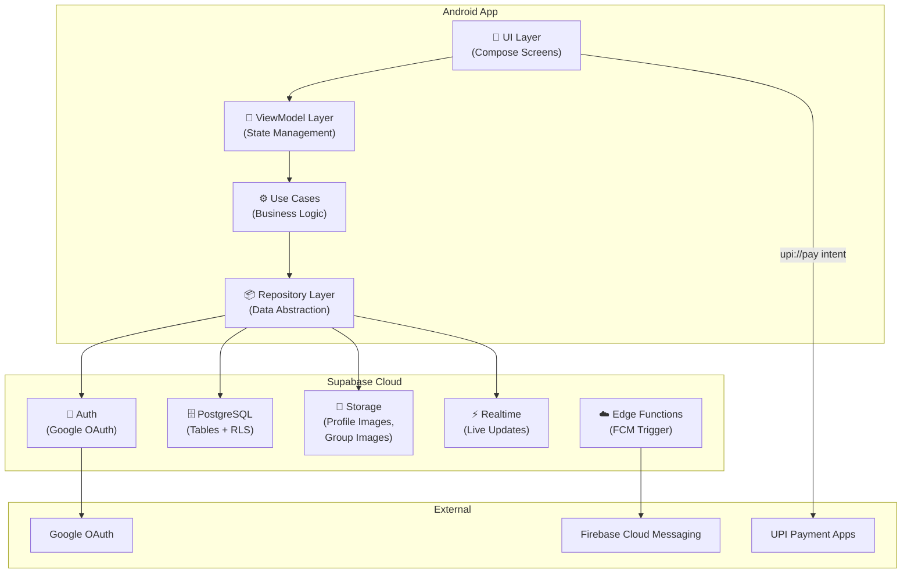
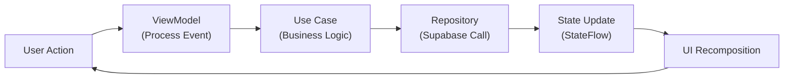
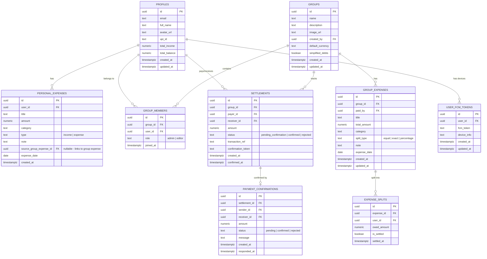

# Expenso — Personal & Group Expense Manager

> A lightweight, beautiful, Splitwise-inspired Android app with glassmorphism UI, Supabase backend, Google Auth, and UPI payment integration.

---

## 📋 Table of Contents

1. [Project Overview](#project-overview)
2. [User Review Required](#user-review-required)
3. [Open Questions](#open-questions)
4. [Tech Stack](#tech-stack)
5. [Architecture Overview](#architecture-overview)
6. [Supabase Database Schema](#supabase-database-schema)
7. [Feature Breakdown](#feature-breakdown)
8. [Screen-by-Screen Design Plan](#screen-by-screen-design-plan)
9. [Proposed File Structure](#proposed-file-structure)
10. [Implementation Phases](#implementation-phases)
11. [Verification Plan](#verification-plan)
12. [Manual Setup Guide (For You)](#manual-setup-guide-for-you)

---

## Project Overview

**Expenso** is a free, personal & group expense manager that lets you:
- Track personal income and expenses with running balance
- Create groups and split expenses among members
- See exactly who owes you (green) and who you owe (red) in each group
- Pay via UPI directly from the app with a confirmation workflow
- Manage your profile with Google-imported photo and details
- Get real-time notifications for payment confirmations

The app should feel **premium and Apple-like** — clean typography, glassmorphism surfaces, smooth animations, and a light attractive theme.

---

## User Review Required

> [!IMPORTANT]
> **Supabase Project**: I'll create the Supabase project and all tables/functions via the MCP tool automatically. You'll need to:
> 1. Create a Google Cloud OAuth Client ID (Web Application type) — I'll provide step-by-step instructions below
> 2. Enable Google provider in Supabase Dashboard with that Client ID
> 3. Add your SHA-1 fingerprint to Google Cloud Console

> [!WARNING]
> **UPI Payment Flow**: The UPI deep-link integration (`upi://pay`) works by launching the user's preferred UPI app with pre-filled data. However, **we cannot programmatically verify the UPI transaction succeeded** — UPI apps return inconsistent responses. Our solution: After payment, the payer taps "I Paid" in our app, which sends a confirmation request to the receiver. The receiver confirms, and only then balances update. This is the most reliable and honest approach.

> [!IMPORTANT]
> **FCM Push Notifications**: For real-time payment confirmation notifications, we need Firebase Cloud Messaging. This requires a Firebase project linked to the app. I'll handle the code, but you'll need to download `google-services.json` from Firebase Console.

---

## Open Questions

> [!IMPORTANT]
> **Q1: App Name** — I'm using "Expenso" based on the project folder. Do you want a different name?

> [!IMPORTANT]
> **Q2: Currency** — The UPI flow is INR-specific. Should the app support multiple currencies, or is INR-only fine for now?

> [!IMPORTANT]
> **Q3: Expense Categories** — Do you want predefined expense categories (Food, Transport, Shopping, Bills, Entertainment, etc.) or a simpler free-text description approach?

> [!IMPORTANT]
> **Q4: Offline Support** — Should the app work offline with local caching and sync when back online, or is online-only acceptable for v1?

> [!IMPORTANT]
> **Q5: Export Feature** — Do you want to export expense reports (PDF/CSV) in v1 or later?

---

## Tech Stack

| Layer | Technology | Why |
|-------|-----------|-----|
| **Language** | Kotlin | Modern, concise, official Android language |
| **UI Framework** | Jetpack Compose | Declarative UI, smooth animations, glassmorphism support |
| **Architecture** | MVVM + Clean Architecture | Scalable, testable, industry standard |
| **DI** | Hilt (Dagger) | Official Google DI for Android |
| **Navigation** | Compose Navigation | Type-safe, composable navigation |
| **Backend** | Supabase | Auth, Database (PostgreSQL), Storage, Realtime, Edge Functions |
| **Auth** | Supabase + Google OAuth | Native Google Sign-In via Credential Manager |
| **Realtime** | Supabase Realtime | Live balance updates, payment confirmations |
| **Notifications** | FCM + Supabase Edge Functions | Background push notifications |
| **Image Loading** | Coil | Lightweight, Compose-native image loading |
| **Blur/Glass** | Haze library + RenderEffect | Hardware-accelerated glassmorphism |
| **UPI** | Android Intent (`upi://pay`) | Native UPI app chooser |
| **Local Cache** | Room (optional for v2) | Offline-first capability |
| **Build** | Gradle (KTS) | Modern build configuration |

---

## Architecture Overview



### Data Flow: Unidirectional (UDF)



---

## Supabase Database Schema

### Entity Relationship Diagram



### Table Details

#### `profiles` — Extended user data from Google Auth
| Column | Type | Description |
|--------|------|-------------|
| `id` | `uuid` PK | Same as `auth.users.id` |
| `email` | `text` | Google email |
| `full_name` | `text` | Editable display name (default: Google name) |
| `avatar_url` | `text` | Profile image URL (default: Google photo, changeable) |
| `upi_id` | `text` | User's UPI VPA for receiving payments |
| `total_income` | `numeric` | Total income added by user |
| `total_balance` | `numeric` | Computed running balance |
| `created_at` | `timestamptz` | Account creation |
| `updated_at` | `timestamptz` | Last profile update |

#### `personal_expenses` — Personal income & expense tracking
| Column | Type | Description |
|--------|------|-------------|
| `id` | `uuid` PK | Unique expense ID |
| `user_id` | `uuid` FK | Owner of this expense |
| `title` | `text` | Expense description |
| `amount` | `numeric` | Transaction amount |
| `category` | `text` | Category (Food, Transport, etc.) |
| `type` | `text` | `income` or `expense` |
| `note` | `text` | Optional note |
| `source_group_expense_id` | `uuid` FK (nullable) | If this came from a group expense |
| `expense_date` | `date` | When it happened |
| `created_at` | `timestamptz` | Record creation |

#### `groups` — Expense sharing groups
| Column | Type | Description |
|--------|------|-------------|
| `id` | `uuid` PK | Group ID |
| `name` | `text` | Group name |
| `description` | `text` | Optional description |
| `image_url` | `text` | Group image (stored in Supabase Storage) |
| `created_by` | `uuid` FK | Creator (admin) |
| `default_currency` | `text` | Default: INR |
| `simplified_debts` | `boolean` | Enable debt simplification |
| `created_at` / `updated_at` | `timestamptz` | Timestamps |

#### `group_members` — Group membership with roles
| Column | Type | Description |
|--------|------|-------------|
| `group_id` | `uuid` FK | The group |
| `user_id` | `uuid` FK | The member |
| `role` | `text` | `admin` (creator only) or `editor` (can add expenses) |
| `joined_at` | `timestamptz` | When they joined |

#### `group_expenses` — Shared expenses within groups
| Column | Type | Description |
|--------|------|-------------|
| `id` | `uuid` PK | Expense ID |
| `group_id` | `uuid` FK | Which group |
| `paid_by` | `uuid` FK | Who paid the full amount |
| `title` | `text` | What was purchased |
| `total_amount` | `numeric` | Total bill amount |
| `category` | `text` | Expense category |
| `split_type` | `text` | `equal`, `exact`, `percentage` |
| `note` | `text` | Optional details |
| `expense_date` | `date` | Date of expense |

#### `expense_splits` — How each expense is divided
| Column | Type | Description |
|--------|------|-------------|
| `expense_id` | `uuid` FK | Which expense |
| `user_id` | `uuid` FK | Who owes this portion |
| `owed_amount` | `numeric` | How much they owe |
| `is_settled` | `boolean` | Whether this split is settled |
| `settled_at` | `timestamptz` | When it was settled |

#### `settlements` — Payment records between users
| Column | Type | Description |
|--------|------|-------------|
| `group_id` | `uuid` FK | Which group context |
| `payer_id` | `uuid` FK | Who paid |
| `receiver_id` | `uuid` FK | Who received |
| `amount` | `numeric` | Amount settled |
| `status` | `text` | `pending_confirmation` → `confirmed` / `rejected` |
| `transaction_ref` | `text` | Unique UPI transaction reference |
| `confirmation_token` | `text` | Token sent to receiver for verification |

#### `payment_confirmations` — Confirmation workflow
| Column | Type | Description |
|--------|------|-------------|
| `settlement_id` | `uuid` FK | Which settlement |
| `sender_id` | `uuid` FK | Who initiated payment |
| `receiver_id` | `uuid` FK | Who needs to confirm |
| `amount` | `numeric` | Amount to confirm |
| `status` | `text` | `pending` → `confirmed` / `rejected` |
| `message` | `text` | Optional note from payer |

### Key Database Functions (PostgreSQL)

1. **`calculate_group_balances(group_id)`** — Returns net balance for every member pair in a group
2. **`get_user_owes_summary(user_id, group_id)`** — Returns who the user owes and who owes them
3. **`confirm_payment(confirmation_id, user_id)`** — Atomically confirms payment, updates splits, and recalculates balances
4. **`add_group_expense_with_splits(expense_data, splits_data)`** — Atomic transaction to add expense + create all splits + mirror to personal expenses
5. **`update_personal_balance(user_id)`** — Recalculates `total_balance` from income, personal expenses, and settled group amounts

### Row Level Security (RLS) Policies

| Table | Policy | Rule |
|-------|--------|------|
| `profiles` | Users can read any profile | `SELECT` for authenticated |
| `profiles` | Users can only update own profile | `UPDATE` where `id = auth.uid()` |
| `personal_expenses` | Users see only their own | `user_id = auth.uid()` |
| `groups` | Members can read their groups | `EXISTS (group_members where user_id = auth.uid())` |
| `groups` | Only creator can update group settings | `created_by = auth.uid()` |
| `group_members` | Members can see other members of their groups | Membership check |
| `group_expenses` | Group members can read/write expenses | Membership check + role check |
| `expense_splits` | Involved users can read their splits | `user_id = auth.uid()` or member of group |
| `settlements` | Involved parties can read | `payer_id = auth.uid() OR receiver_id = auth.uid()` |
| `payment_confirmations` | Sender and receiver can access | `sender_id = auth.uid() OR receiver_id = auth.uid()` |

---

## Feature Breakdown

### 🔐 1. Authentication
- **Google Sign-In Only** — Native via Android Credential Manager + Supabase `compose-auth`
- On first login: Create `profiles` row with Google name, email, and photo
- Session persistence: Supabase handles token refresh automatically
- Sign out: Clear session, navigate to login screen

### 👤 2. Profile Management
- **Default data from Google**: Name, email, profile photo
- **Editable fields**: Full name, profile photo (upload to Supabase Storage), UPI ID
- **Balance Dashboard**: Shows total income, total expenses, current balance
- UPI ID is critical — required for receiving payments

### 💰 3. Personal Expense Tracking
- **Add Income**: Record salary, freelance income, etc. → Adds to `total_income` and `total_balance`
- **Add Expense**: Record personal expenses → Deducts from `total_balance`
- **Auto-linked from Groups**: When a group expense involves you, your share auto-appears in personal expenses (with a link badge showing it came from a group)
- **Balance Calculation**:
  ```
  Balance = Total Income 
          - Sum(Personal Expenses) 
          - Sum(Group Expenses where you owe) 
          + Sum(Settlements received and confirmed)
          - Sum(Settlements you paid and confirmed)
  ```
- **Monthly View**: Expenses grouped by month with totals
- **Category Breakdown**: Pie chart showing spending by category

### 👥 4. Group Management
- **Create Group**: Name, optional image, description
- **Add Members**: Search by email (must have Expenso account) → Like Google product sharing
  - Creator = `admin` role (only one who can manage group settings)
  - Members = `editor` role (can add expenses, view everything)
- **Group Settings** (admin only): Change name, image, description, remove members
- **Group Dashboard**: 
  - Total group spending
  - Each member shown with photo + name + owe status
  - **Red amount** = You owe them
  - **Green amount** = They owe you  
  - **Grey** = Settled
  - "Pay" button next to red (owe) amounts

### 💸 5. Group Expense Adding (Easy Flow)
1. Tap `+` in group → "Add Expense" bottom sheet
2. Enter: Title, Amount, Category (quick-select chips), Date
3. **Paid by**: Defaults to "You" (tap to change to another member)
4. **Split among**: Shows all members with checkboxes — **ALL CHECKED BY DEFAULT**
   - Uncheck anyone you want to exclude
   - Split type selector: Equal (default) | Exact Amounts | Percentage
5. Tap "Add" → Expense created + splits calculated + personal expense entries created for all involved members
6. Animation confirms success

### 💳 6. UPI Payment Flow
1. In group member list, user sees "Pay ₹500" button (red) next to a member they owe
2. Tap "Pay" → Bottom sheet shows:
   - Receiver's name and photo
   - Amount (pre-filled from owed amount, editable for partial payment)
   - "Choose UPI App" button
3. Tap "Choose UPI App" → Android Intent fires `upi://pay` URI with:
   - `pa` = receiver's UPI ID from database
   - `pn` = receiver's name
   - `am` = amount
   - `tr` = unique transaction reference
   - `tn` = "Expenso settlement - [Group Name]"
4. UPI app opens → user enters PIN → payment processes
5. User returns to Expenso → "Confirm Payment" screen appears
6. Tap "I've Paid ₹500" → Creates a `settlement` record with status `pending_confirmation`
7. **Receiver gets a push notification**: "Yuvraj says they paid you ₹500. Confirm?"
8. Receiver opens notification → Sees confirmation dialog with amount and payer details
9. Receiver taps "Confirm" → Settlement status → `confirmed`
   - Splits marked as settled
   - Payer's personal balance deducts ₹500
   - Receiver's personal balance adds ₹500
   - Group balances recalculated
10. If receiver taps "Reject" → Settlement status → `rejected`, balances unchanged, payer notified

### 🔔 7. Notifications
- **Payment Confirmation Requests**: "[Name] says they paid you ₹X. Confirm?"
- **Expense Added**: "[Name] added ₹X for [Title] in [Group]"
- **Member Added/Removed**: "[Name] added you to [Group]"
- **Reminder** (future): "You owe ₹X to [Name] in [Group]"
- Implementation: Supabase Database Webhook → Edge Function → FCM

### 📊 8. Dashboard / Home Screen
- **Greeting**: "Hey Yuvraj 👋" with time-appropriate message
- **Balance Card** (glassmorphism): Current balance, income this month, expenses this month
- **Quick Actions**: Add Expense, Add Income, Create Group
- **Recent Activity**: Last 5-10 transactions (personal + group mixed)
- **Summary Cards**: "You owe ₹1,200 total" / "You are owed ₹800 total"

---

## Screen-by-Screen Design Plan

### Design Language
- **Theme**: Light mode, white/cream base with soft gradient accents
- **Primary Color**: Deep Indigo `#4F46E5` (rich, premium feel)
- **Accent Color**: Emerald `#10B981` (for positive/income) + Rose `#F43F5E` (for negative/owe)
- **Glass Surfaces**: White at 60-70% opacity, 20px blur radius, 1px white border, subtle shadow
- **Typography**: Google Fonts — **Inter** (clean, Apple-like), various weights
- **Border Radius**: 16-24px for cards, 12px for buttons, full-round for avatars
- **Animations**: Shared element transitions, spring physics, fade-ins, subtle scale on tap
- **Icons**: Material Symbols Rounded (outlined style)

### Screen List

| # | Screen | Description |
|---|--------|-------------|
| 1 | **Splash Screen** | App logo + gradient background, auto-navigate based on auth state |
| 2 | **Login Screen** | Beautiful gradient background + glass card + "Sign in with Google" button |
| 3 | **Onboarding** (first login) | 3 slides: Welcome, Add UPI ID, Start exploring |
| 4 | **Home / Dashboard** | Balance card + quick actions + recent activity + owe summary |
| 5 | **Personal Expenses** | List of all personal transactions, filter by month/category, add button |
| 6 | **Add Personal Expense** | Bottom sheet: title, amount, category chips, type toggle (income/expense), date |
| 7 | **Groups List** | All groups with thumbnails, member count, your net balance per group |
| 8 | **Create Group** | Full screen: name, image picker, description |
| 9 | **Group Detail** | Group image header + member list with owe/owed + expense history |
| 10 | **Group Settings** | Admin only: edit name, image, manage members |
| 11 | **Add Group Expense** | Bottom sheet: title, amount, paid by, split checkboxes, split type |
| 12 | **Expense Detail** | Full breakdown: who paid, how it was split, each person's share |
| 13 | **Pay via UPI** | Bottom sheet: receiver info, amount, UPI app chooser |
| 14 | **Payment Confirmation** | Payer: "I've Paid" / Receiver: "Confirm/Reject" dialog |
| 15 | **Add Member** | Search by email, invite flow |
| 16 | **Profile Screen** | Avatar, name, email, UPI ID, edit options |
| 17 | **Edit Profile** | Change name, photo, UPI ID |
| 18 | **Notifications** | List of all payment confirmations and activity |
| 19 | **Statistics** (v2) | Charts for spending breakdown |

---

## Proposed File Structure

```
d:\Project\Expenso\
├── app/
│   ├── build.gradle.kts
│   ├── src/main/
│   │   ├── AndroidManifest.xml
│   │   ├── java/com/expenso/app/
│   │   │   ├── ExpensoApp.kt                    # Application class
│   │   │   ├── MainActivity.kt                  # Single Activity
│   │   │   │
│   │   │   ├── core/                             # Core shared module
│   │   │   │   ├── di/                           # Hilt DI modules
│   │   │   │   │   ├── AppModule.kt              # Supabase client, Ktor
│   │   │   │   │   ├── RepositoryModule.kt       # Repository bindings
│   │   │   │   │   └── UseCaseModule.kt          # Use case bindings
│   │   │   │   ├── network/
│   │   │   │   │   └── SupabaseClient.kt         # Supabase client setup
│   │   │   │   ├── util/
│   │   │   │   │   ├── Constants.kt              # App-wide constants
│   │   │   │   │   ├── Extensions.kt             # Kotlin extensions
│   │   │   │   │   ├── DateUtils.kt              # Date formatting
│   │   │   │   │   ├── CurrencyFormatter.kt      # ₹ formatting
│   │   │   │   │   └── UpiHelper.kt              # UPI intent builder
│   │   │   │   └── notification/
│   │   │   │       ├── FCMService.kt             # Firebase messaging service
│   │   │   │       └── NotificationHelper.kt     # Notification channel + display
│   │   │   │
│   │   │   ├── domain/                           # Domain layer (pure Kotlin)
│   │   │   │   ├── model/                        # Domain entities
│   │   │   │   │   ├── User.kt
│   │   │   │   │   ├── PersonalExpense.kt
│   │   │   │   │   ├── Group.kt
│   │   │   │   │   ├── GroupMember.kt
│   │   │   │   │   ├── GroupExpense.kt
│   │   │   │   │   ├── ExpenseSplit.kt
│   │   │   │   │   ├── Settlement.kt
│   │   │   │   │   ├── PaymentConfirmation.kt
│   │   │   │   │   └── BalanceSummary.kt
│   │   │   │   ├── repository/                   # Repository interfaces
│   │   │   │   │   ├── AuthRepository.kt
│   │   │   │   │   ├── ProfileRepository.kt
│   │   │   │   │   ├── PersonalExpenseRepository.kt
│   │   │   │   │   ├── GroupRepository.kt
│   │   │   │   │   ├── GroupExpenseRepository.kt
│   │   │   │   │   ├── SettlementRepository.kt
│   │   │   │   │   └── NotificationRepository.kt
│   │   │   │   └── usecase/                      # Business logic
│   │   │   │       ├── auth/
│   │   │   │       │   ├── SignInWithGoogleUseCase.kt
│   │   │   │       │   ├── SignOutUseCase.kt
│   │   │   │       │   └── GetCurrentUserUseCase.kt
│   │   │   │       ├── profile/
│   │   │   │       │   ├── GetProfileUseCase.kt
│   │   │   │       │   ├── UpdateProfileUseCase.kt
│   │   │   │       │   └── UploadAvatarUseCase.kt
│   │   │   │       ├── personal/
│   │   │   │       │   ├── AddPersonalExpenseUseCase.kt
│   │   │   │       │   ├── AddIncomeUseCase.kt
│   │   │   │       │   ├── GetPersonalExpensesUseCase.kt
│   │   │   │       │   ├── GetBalanceSummaryUseCase.kt
│   │   │   │       │   └── DeletePersonalExpenseUseCase.kt
│   │   │   │       ├── group/
│   │   │   │       │   ├── CreateGroupUseCase.kt
│   │   │   │       │   ├── GetGroupsUseCase.kt
│   │   │   │       │   ├── GetGroupDetailUseCase.kt
│   │   │   │       │   ├── UpdateGroupUseCase.kt
│   │   │   │       │   ├── AddMemberUseCase.kt
│   │   │   │       │   ├── RemoveMemberUseCase.kt
│   │   │   │       │   └── GetGroupBalancesUseCase.kt
│   │   │   │       ├── expense/
│   │   │   │       │   ├── AddGroupExpenseUseCase.kt
│   │   │   │       │   ├── GetGroupExpensesUseCase.kt
│   │   │   │       │   ├── CalculateSplitsUseCase.kt
│   │   │   │       │   └── DeleteGroupExpenseUseCase.kt
│   │   │   │       └── settlement/
│   │   │   │           ├── InitiatePaymentUseCase.kt
│   │   │   │           ├── ConfirmPaymentUseCase.kt
│   │   │   │           ├── RejectPaymentUseCase.kt
│   │   │   │           └── GetPendingConfirmationsUseCase.kt
│   │   │   │
│   │   │   ├── data/                             # Data layer
│   │   │   │   ├── repository/                   # Repository implementations
│   │   │   │   │   ├── AuthRepositoryImpl.kt
│   │   │   │   │   ├── ProfileRepositoryImpl.kt
│   │   │   │   │   ├── PersonalExpenseRepositoryImpl.kt
│   │   │   │   │   ├── GroupRepositoryImpl.kt
│   │   │   │   │   ├── GroupExpenseRepositoryImpl.kt
│   │   │   │   │   ├── SettlementRepositoryImpl.kt
│   │   │   │   │   └── NotificationRepositoryImpl.kt
│   │   │   │   ├── dto/                          # Data Transfer Objects
│   │   │   │   │   ├── ProfileDto.kt
│   │   │   │   │   ├── PersonalExpenseDto.kt
│   │   │   │   │   ├── GroupDto.kt
│   │   │   │   │   ├── GroupMemberDto.kt
│   │   │   │   │   ├── GroupExpenseDto.kt
│   │   │   │   │   ├── ExpenseSplitDto.kt
│   │   │   │   │   ├── SettlementDto.kt
│   │   │   │   │   └── PaymentConfirmationDto.kt
│   │   │   │   └── mapper/                       # DTO ↔ Domain mappers
│   │   │   │       └── Mappers.kt
│   │   │   │
│   │   │   └── ui/                               # Presentation layer
│   │   │       ├── navigation/
│   │   │       │   ├── ExpensoNavGraph.kt        # Nav graph definition
│   │   │       │   ├── Screen.kt                 # Sealed class for routes
│   │   │       │   └── BottomNavBar.kt           # Bottom navigation
│   │   │       ├── theme/
│   │   │       │   ├── Color.kt                  # Color palette
│   │   │       │   ├── Type.kt                   # Typography (Inter font)
│   │   │       │   ├── Shape.kt                  # Rounded shapes
│   │   │       │   ├── Theme.kt                  # Material3 theme
│   │   │       │   └── GlassEffect.kt            # Glassmorphism modifier
│   │   │       ├── components/                    # Reusable composables
│   │   │       │   ├── GlassCard.kt              # Frosted glass card
│   │   │       │   ├── GlassBottomSheet.kt       # Glass bottom sheet
│   │   │       │   ├── BalanceChip.kt            # Green/Red balance indicator
│   │   │       │   ├── CategoryChip.kt           # Expense category selector
│   │   │       │   ├── MemberRow.kt              # Member with avatar + balance
│   │   │       │   ├── ExpenseCard.kt            # Expense list item
│   │   │       │   ├── QuickActionButton.kt      # Dashboard action buttons
│   │   │       │   ├── AnimatedCounter.kt        # Animated number display
│   │   │       │   ├── AvatarImage.kt            # Circular avatar with loader
│   │   │       │   ├── EmptyState.kt             # Beautiful empty state
│   │   │       │   ├── LoadingState.kt           # Shimmer loading
│   │   │       │   ├── ConfirmDialog.kt          # Payment confirm dialog
│   │   │       │   └── SearchBar.kt              # Member search
│   │   │       ├── screen/
│   │   │       │   ├── splash/
│   │   │       │   │   └── SplashScreen.kt
│   │   │       │   ├── auth/
│   │   │       │   │   ├── LoginScreen.kt
│   │   │       │   │   ├── LoginViewModel.kt
│   │   │       │   │   └── OnboardingScreen.kt
│   │   │       │   ├── home/
│   │   │       │   │   ├── HomeScreen.kt
│   │   │       │   │   └── HomeViewModel.kt
│   │   │       │   ├── personal/
│   │   │       │   │   ├── PersonalExpenseScreen.kt
│   │   │       │   │   ├── PersonalExpenseViewModel.kt
│   │   │       │   │   └── AddPersonalExpenseSheet.kt
│   │   │       │   ├── groups/
│   │   │       │   │   ├── GroupListScreen.kt
│   │   │       │   │   ├── GroupListViewModel.kt
│   │   │       │   │   ├── CreateGroupScreen.kt
│   │   │       │   │   ├── CreateGroupViewModel.kt
│   │   │       │   │   ├── GroupDetailScreen.kt
│   │   │       │   │   ├── GroupDetailViewModel.kt
│   │   │       │   │   ├── GroupSettingsScreen.kt
│   │   │       │   │   ├── AddMemberSheet.kt
│   │   │       │   │   ├── AddGroupExpenseSheet.kt
│   │   │       │   │   └── ExpenseDetailScreen.kt
│   │   │       │   ├── payment/
│   │   │       │   │   ├── PaymentSheet.kt
│   │   │       │   │   ├── PaymentViewModel.kt
│   │   │       │   │   └── ConfirmationScreen.kt
│   │   │       │   ├── profile/
│   │   │       │   │   ├── ProfileScreen.kt
│   │   │       │   │   ├── ProfileViewModel.kt
│   │   │       │   │   └── EditProfileScreen.kt
│   │   │       │   └── notifications/
│   │   │       │       ├── NotificationScreen.kt
│   │   │       │       └── NotificationViewModel.kt
│   │   │       └── state/                        # UI state classes
│   │   │           ├── HomeUiState.kt
│   │   │           ├── PersonalExpenseUiState.kt
│   │   │           ├── GroupUiState.kt
│   │   │           ├── GroupDetailUiState.kt
│   │   │           ├── PaymentUiState.kt
│   │   │           └── ProfileUiState.kt
│   │   │
│   │   └── res/
│   │       ├── values/
│   │       │   ├── strings.xml
│   │       │   ├── colors.xml
│   │       │   └── themes.xml
│   │       ├── drawable/                         # Icons, gradients
│   │       ├── font/                             # Inter font family
│   │       └── mipmap/                           # App icons
│   │
├── build.gradle.kts                              # Project-level build
├── settings.gradle.kts
├── gradle.properties
├── google-services.json                          # Firebase config (manual)
└── supabase/
    └── functions/
        └── send-notification/
            └── index.ts                          # Edge function for FCM
```

---

## Implementation Phases

### Phase 1: Foundation (Week 1)
> Setup project, auth, profile, and core UI components

| Task | Details |
|------|---------|
| Project Setup | Create Android project with Compose, add all dependencies |
| Supabase Setup | Create project, tables, RLS policies via MCP |
| Google OAuth | Configure Google Cloud Console + Supabase Auth |
| Theme System | Colors, typography (Inter), shapes, glassmorphism modifiers |
| Glass Components | GlassCard, GlassBottomSheet, reusable composables |
| Splash Screen | Animated logo with auth state check |
| Login Screen | Gradient background + glass card + Google sign-in |
| Profile Screen | View/edit profile, avatar upload |
| Navigation | Bottom nav bar with 4 tabs (Home, Expenses, Groups, Profile) |

### Phase 2: Personal Expenses (Week 2)
> Complete personal finance tracking

| Task | Details |
|------|---------|
| Add Income Flow | Bottom sheet with amount, category, date |
| Add Expense Flow | Bottom sheet with full details + category chips |
| Expense List | Chronological list with month grouping |
| Balance Calculation | Real-time balance from income - expenses |
| Home Dashboard | Balance card, recent transactions, quick actions |
| Category System | Predefined categories with icons |
| Delete/Edit | Swipe-to-delete, tap-to-edit |

### Phase 3: Groups (Week 3)
> Group CRUD and member management

| Task | Details |
|------|---------|
| Create Group | Name, image upload, description |
| Group List | All groups with thumbnails and net balance |
| Group Detail | Member list with owe/owed amounts |
| Member Management | Add by email, remove (admin only) |
| Group Settings | Edit name/image/description (admin only) |
| Role System | Admin vs editor permissions |

### Phase 4: Group Expenses & Splitting (Week 4)
> Core expense splitting engine

| Task | Details |
|------|---------|
| Add Group Expense | Title, amount, payer, split selection |
| Split Calculator | Equal/exact/percentage split logic |
| Member Checkboxes | All-checked-by-default split selection |
| Auto-Personal Sync | Group expenses mirror to personal expenses |
| Balance Engine | Calculate net owe/owed per member pair |
| Expense History | Group expense feed with split details |

### Phase 5: Payments & Settlements (Week 5)
> UPI payment and confirmation workflow

| Task | Details |
|------|---------|
| UPI Intent | Build `upi://pay` URI, launch app chooser |
| Payment Sheet | Pre-filled amount, receiver info, app selection |
| "I Paid" Flow | Create settlement record |
| Confirmation Push | FCM notification to receiver |
| Confirm/Reject UI | Dialog for receiver to confirm |
| Settlement Logic | Atomic balance updates on confirmation |
| Edge Function | Supabase → FCM bridge |

### Phase 6: Polish & Ship (Week 6)
> Animations, edge cases, testing

| Task | Details |
|------|---------|
| Animations | Screen transitions, number counters, spring physics |
| Error Handling | Network errors, edge cases, empty states |
| Loading States | Shimmer placeholders |
| Onboarding | First-time user UPI ID setup |
| Testing | ViewModel unit tests, integration tests |
| Performance | Lazy loading, pagination for expenses |
| App Icon | Custom icon design |

---

## Verification Plan

### Automated Tests
```bash
# Run unit tests
./gradlew test

# Run instrumented tests (requires emulator/device)
./gradlew connectedAndroidTest
```

- **ViewModel Tests**: Verify state transitions for all ViewModels
- **Use Case Tests**: Test split calculation, balance computation, payment confirmation logic
- **Repository Tests**: Mock Supabase responses, verify data mapping

### Manual Verification
1. **Auth Flow**: Sign in with Google → profile created → sign out → sign back in
2. **Personal Expenses**: Add income → add expenses → verify balance updates correctly
3. **Group Flow**: Create group → add members → add expense with splits → verify balances
4. **Payment Flow**: Tap Pay → choose UPI app → return → confirm → verify balances settled
5. **Notification Flow**: Payment confirmation → receiver gets notification → confirms → both balances update
6. **Profile**: Change name → change photo → change UPI ID → verify changes persist
7. **Edge Cases**: Remove member from group with unsettled debts, delete expense, partial payment

---

## Manual Setup Guide (For You)

> [!CAUTION]
> These are the ONLY steps you need to do manually. Everything else (Supabase tables, functions, RLS, Edge Functions) will be automated by me via the Supabase MCP.

### Step 1: Google Cloud Console — OAuth Client ID

1. Go to [Google Cloud Console](https://console.cloud.google.com/)
2. Create a new project (or select existing) named "Expenso"
3. Navigate to **APIs & Services → Credentials**
4. Click **+ CREATE CREDENTIALS → OAuth client ID**
5. Select Application type: **Web application**
6. Name: "Expenso Web Client"
7. Add **Authorized redirect URIs**: `https://<your-supabase-project-ref>.supabase.co/auth/v1/callback`
8. Click Create → Copy the **Client ID** and **Client Secret**

> [!TIP]
> Yes, you need a **Web Application** type even for Android. This is how Supabase's native Google login works with the Credential Manager API.

### Step 2: Get Your Android SHA-1 Fingerprint

Run this in your terminal:
```bash
# For debug keystore
keytool -list -v -keystore "%USERPROFILE%\.android\debug.keystore" -alias androiddebugkey -storepass android -keypass android
```
Copy the **SHA1** fingerprint.

### Step 3: Google Cloud Console — Android Configuration

1. Go back to **APIs & Services → Credentials**
2. Click **+ CREATE CREDENTIALS → OAuth client ID**  
3. Select Application type: **Android**
4. Package name: `com.expenso.app`
5. SHA-1 certificate fingerprint: paste from Step 2
6. Click Create (you don't need to copy this ID, it's just for linking)

### Step 4: Enable Google Auth in Supabase

1. Go to your Supabase Dashboard → **Authentication → Providers**
2. Enable **Google**
3. Paste the **Client ID** (from Step 1, the Web Application one)
4. Paste the **Client Secret** (from Step 1)
5. Save

### Step 5: Firebase Project for FCM

1. Go to [Firebase Console](https://console.firebase.google.com/)
2. Create project or link to your Google Cloud project from Step 1
3. Add an Android app with package name: `com.expenso.app`
4. Add your SHA-1 fingerprint
5. Download `google-services.json` → place in `d:\Project\Expenso\app\`
6. Go to **Project Settings → Service Accounts → Generate new private key**
7. Save this JSON — it will be used in the Supabase Edge Function as a secret

### Step 6: Share Info With Me

After completing the above steps, share with me:
- ✅ Your Supabase project URL (I'll get this when I create it via MCP)
- ✅ Google OAuth Client ID and Secret (for Supabase provider config)
- ✅ Confirmation that `google-services.json` is placed in the app folder
- ✅ Firebase service account JSON (for Edge Function secret)
