# Expenso — User Flow & Workflow Documentation

> Detailed user journeys, state machines, and interaction patterns for every feature.

---

## 1. Authentication Flow

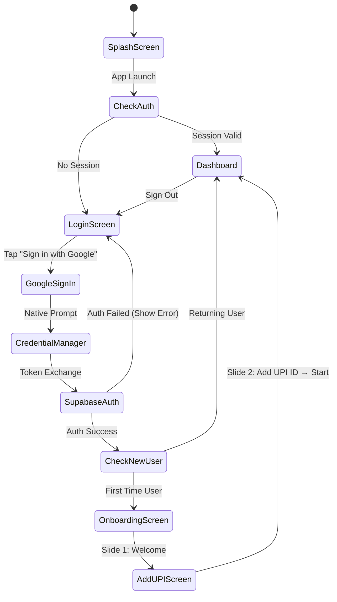

### Detailed Steps:
1. **App opens** → Splash screen with logo animation (1.5s)
2. **Check Supabase session** → If valid token exists, auto-navigate to Dashboard
3. **No session** → Show Login screen with gradient background
4. **User taps "Sign in with Google"** → Android Credential Manager shows account picker
5. **Select Google account** → Credential Manager returns ID token to Supabase
6. **Supabase authenticates** → Creates/fetches user in `auth.users`
7. **Check `profiles` table** → If no row exists, it's a new user
8. **New user**: Insert profile row with Google name, email, photo → Show onboarding
9. **Onboarding**: Welcome → Enter UPI ID (optional, can skip) → Navigate to Dashboard
10. **Returning user**: Navigate directly to Dashboard

---

## 2. Personal Expense Flow

### Adding Income

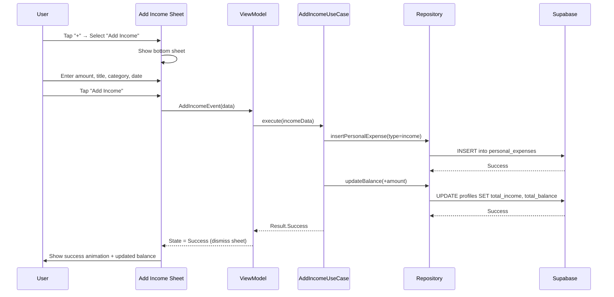

### Adding Personal Expense

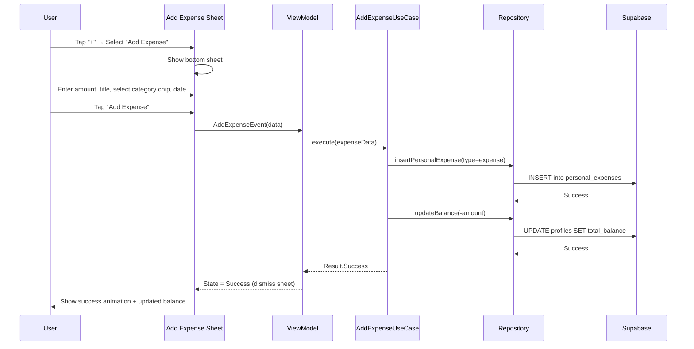

### Balance Calculation Logic

```
total_balance = total_income
              - SUM(personal_expenses WHERE type='expense')
              + SUM(confirmed settlements WHERE I am receiver)
              - SUM(confirmed settlements WHERE I am payer)
```

When a group expense is added where the user is involved:
- A `personal_expense` entry is auto-created with `source_group_expense_id` set
- The user's `total_balance` is updated by deducting their share

---

## 3. Group Management Flow

### Creating a Group

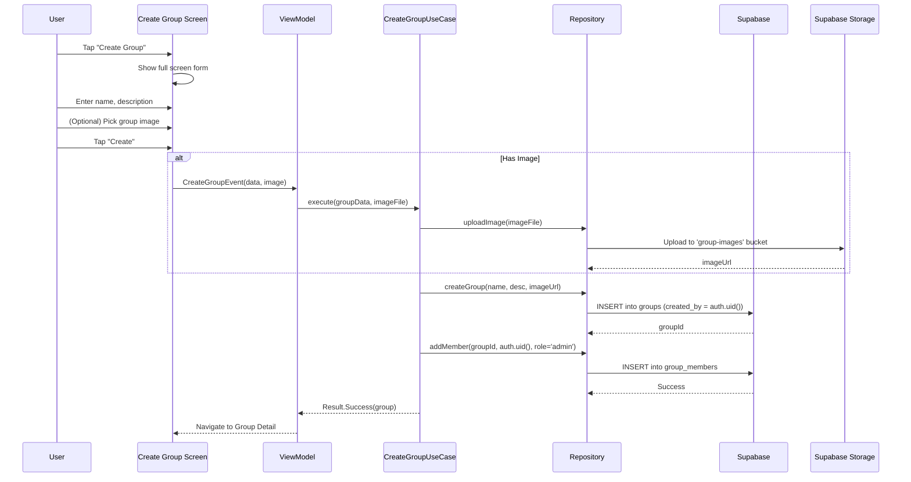

### Adding Members

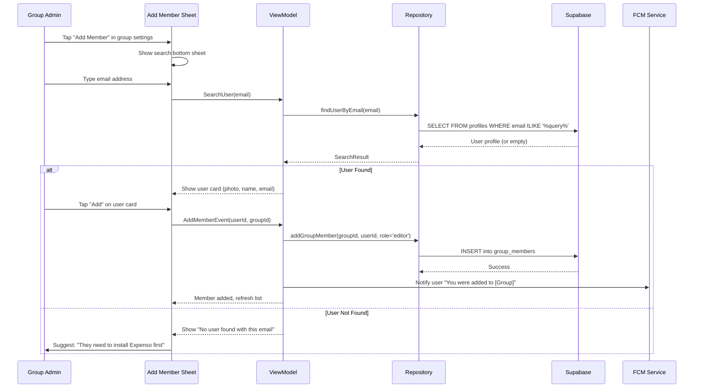

### Access Control Matrix

| Action | Admin | Editor |
|--------|-------|--------|
| View group | ✅ | ✅ |
| Add expenses | ✅ | ✅ |
| Edit expenses (own) | ✅ | ✅ |
| Delete expenses (own) | ✅ | ✅ |
| View all members | ✅ | ✅ |
| View balances | ✅ | ✅ |
| Edit group name/image | ✅ | ❌ |
| Add members | ✅ | ❌ |
| Remove members | ✅ | ❌ |
| Delete group | ✅ | ❌ |

---

## 4. Group Expense & Splitting Flow

### Adding a Group Expense

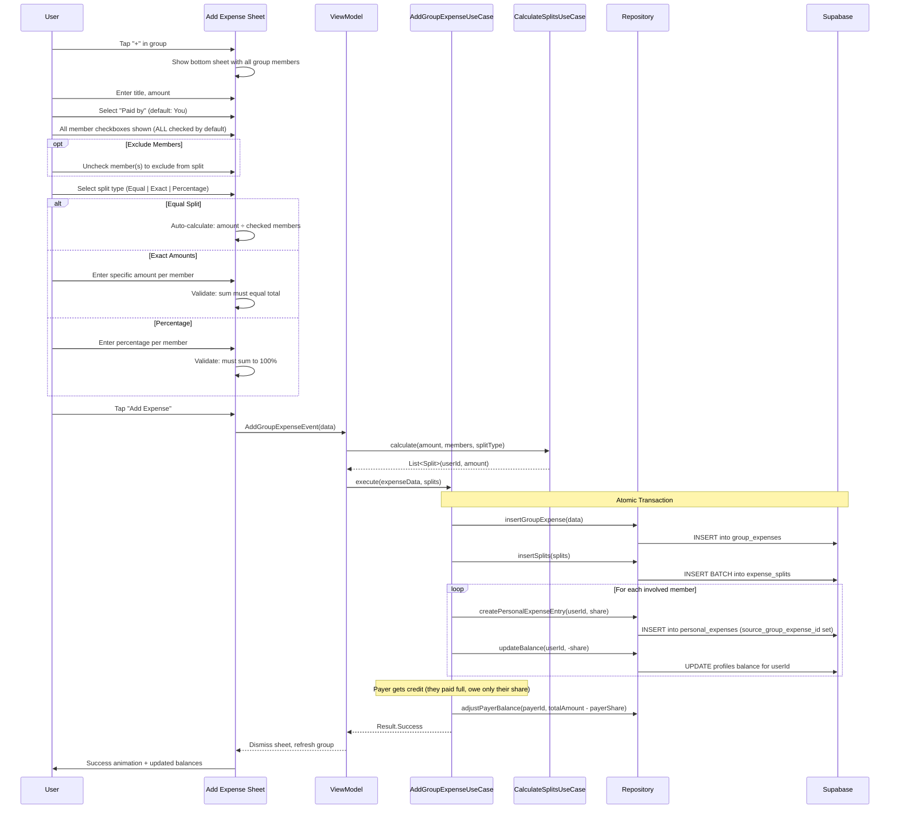

### Split Calculation Examples

**Scenario**: Dinner costs ₹1,200. Paid by Alice. Group has Alice, Bob, Charlie, Dave.

#### Equal Split (all 4 checked):
| Person | Share | Owes to Alice |
|--------|-------|---------------|
| Alice (payer) | ₹300 | — |
| Bob | ₹300 | ₹300 |
| Charlie | ₹300 | ₹300 |
| Dave | ₹300 | ₹300 |

#### Equal Split (Dave unchecked — only 3 people):
| Person | Share | Owes to Alice |
|--------|-------|---------------|
| Alice (payer) | ₹400 | — |
| Bob | ₹400 | ₹400 |
| Charlie | ₹400 | ₹400 |
| Dave | — | — |

### Balance Computation Algorithm

For a group with N expenses:

```
For each member pair (A, B):
    balance_A_to_B = 0
    
    For each expense E:
        if E.paid_by == A and B has a split in E:
            balance_A_to_B += B's split amount    # B owes A
        if E.paid_by == B and A has a split in E:
            balance_A_to_B -= A's split amount    # A owes B
    
    For each confirmed settlement S between A and B:
        if S.payer == B and S.receiver == A:
            balance_A_to_B -= S.amount            # B paid A back
        if S.payer == A and S.receiver == B:
            balance_A_to_B += S.amount            # A paid B (shouldn't normally happen here)
    
    if balance_A_to_B > 0:
        "B owes A ₹{balance_A_to_B}"  → Show GREEN next to B for A's view
    elif balance_A_to_B < 0:
        "A owes B ₹{|balance_A_to_B|}"  → Show RED next to B for A's view + PAY button
    else:
        "Settled up"  → Show GREY
```

---

## 5. UPI Payment & Confirmation Flow

This is the most complex flow — here's the complete state machine:

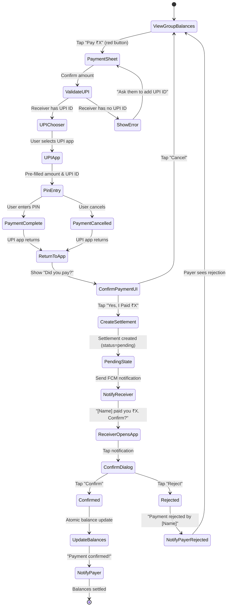

### UPI Intent Data:

```kotlin
val upiUri = Uri.Builder()
    .scheme("upi")
    .authority("pay")
    .appendQueryParameter("pa", receiverUpiId)      // e.g., "user@okaxis"
    .appendQueryParameter("pn", receiverName)        // e.g., "Rahul Sharma"
    .appendQueryParameter("am", amount.toString())   // e.g., "500.00"
    .appendQueryParameter("cu", "INR")
    .appendQueryParameter("tr", transactionRef)      // UUID
    .appendQueryParameter("tn", "Expenso - $groupName settlement")
    .build()

val intent = Intent(Intent.ACTION_VIEW, upiUri)
startActivityForResult(Intent.createChooser(intent, "Pay with"), UPI_REQUEST_CODE)
```

### Confirmation Token System:

When payer taps "I Paid":
1. Generate a unique `confirmation_token` (UUID)
2. Create `settlement` record with `status = 'pending_confirmation'`
3. Create `payment_confirmation` record with `status = 'pending'`
4. Trigger Edge Function → send FCM to receiver
5. FCM payload includes: `settlement_id`, `amount`, `payer_name`, `confirmation_token`

When receiver taps "Confirm":
1. Verify `confirmation_token` matches
2. Update `settlement.status = 'confirmed'`
3. Update `payment_confirmation.status = 'confirmed'`
4. Mark relevant `expense_splits` as settled
5. Update both users' `total_balance` in `profiles`
6. Send FCM to payer: "Payment confirmed!"

---

## 6. Notification System Flow

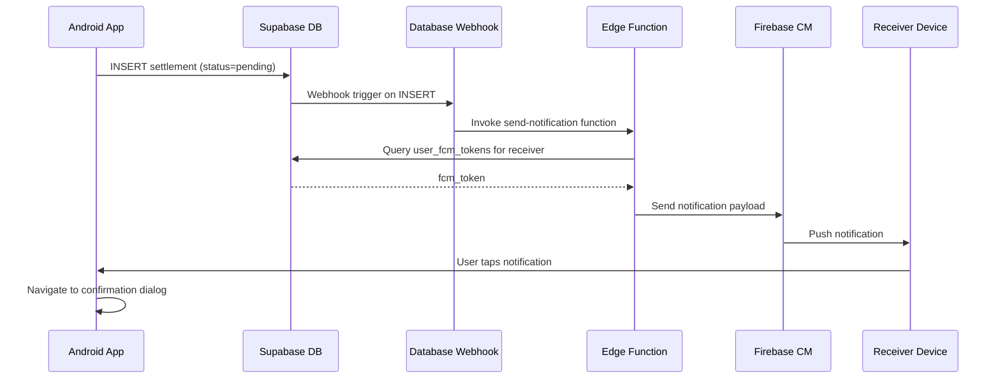

### Notification Types:

| Event | Recipient | Title | Body |
|-------|-----------|-------|------|
| Payment Made | Receiver | "💰 Payment Received" | "{Name} says they paid you ₹{amount}. Tap to confirm." |
| Payment Confirmed | Payer | "✅ Payment Confirmed" | "{Name} confirmed your ₹{amount} payment." |
| Payment Rejected | Payer | "❌ Payment Rejected" | "{Name} rejected your ₹{amount} payment claim." |
| Expense Added | All Members | "📝 New Expense" | "{Name} added ₹{amount} for {title} in {group}." |
| Added to Group | New Member | "👥 Group Invite" | "{Name} added you to {group}." |
| Removed from Group | Removed | "👋 Group Update" | "You were removed from {group}." |

---

## 7. Profile Management Flow

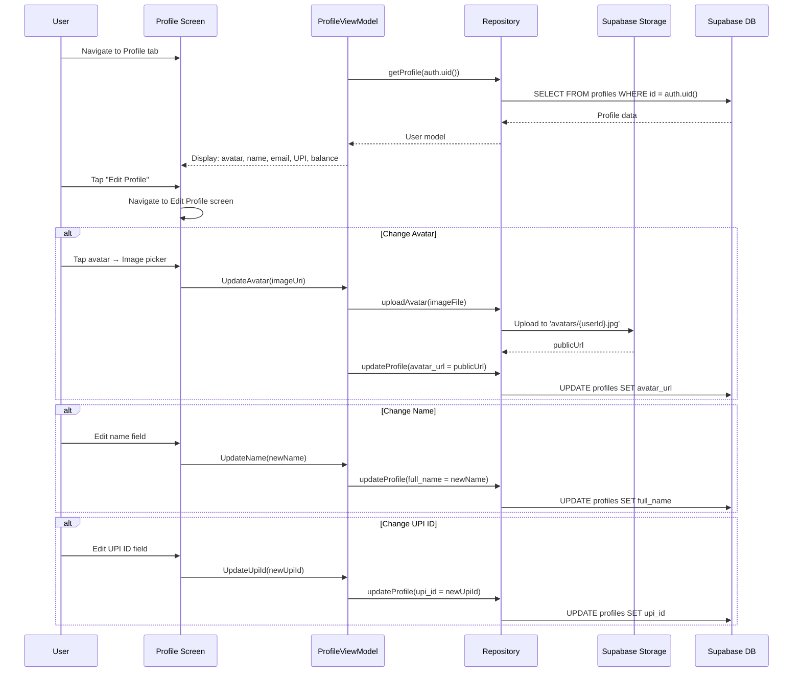

---

## 8. Home Dashboard Data Flow

The home screen aggregates data from multiple sources:

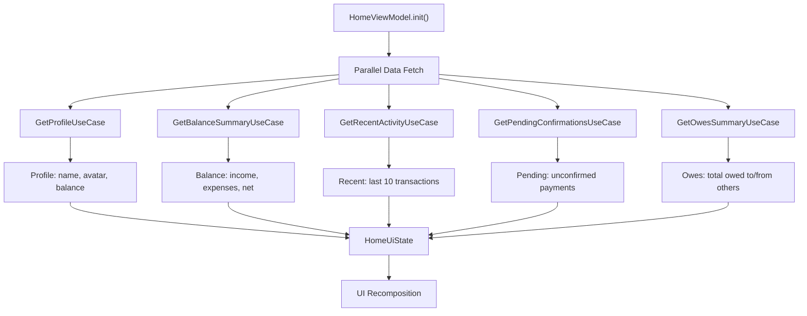

### Dashboard Cards:
1. **Balance Card** (Glass): ₹XX,XXX current balance | ₹X,XXX income this month | ₹X,XXX expenses this month
2. **Owe Summary**: "You owe ₹1,200 total" (red) | "You are owed ₹800 total" (green)
3. **Pending Actions**: Payment confirmations waiting
4. **Recent Activity**: Mixed feed of personal + group transactions
5. **Quick Actions**: FAB with Add Expense / Add Income / Create Group

---

## 9. Data Sync: Group → Personal Expenses

When a group expense is created, each member's share is automatically reflected in their personal expenses:

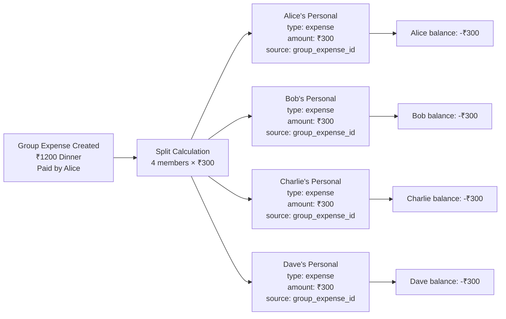

> Personal expenses from groups show a badge/icon indicating "From Group: [Name]" so the user knows it wasn't manually added.

---

## 10. Edge Cases & Error Handling

| Scenario | Handling |
|----------|----------|
| **User removed from group with unsettled debts** | Show warning to admin. Debts remain visible in the removed user's personal expenses. |
| **UPI app not installed** | Show toast: "No UPI app found. Please install one." |
| **Receiver has no UPI ID** | Disable "Pay" button, show tooltip: "Ask [Name] to add their UPI ID" |
| **Network failure during expense add** | Show retry dialog. Don't save partial data. |
| **Duplicate payment confirmation** | Server-side check: if already confirmed, return "Already settled" |
| **Group deleted with pending settlements** | Settle all debts before allowing deletion |
| **Partial payment** | User can edit amount before paying. Creates settlement for that amount only. Remaining debt stays. |
| **User pays more than owed** | Cap payment at owed amount. Don't allow overpayment. |
| **Same user in multiple groups with same person** | Each group maintains independent balances |
| **Delete group expense** | Reverse all splits, remove personal expense entries, recalculate balances |
